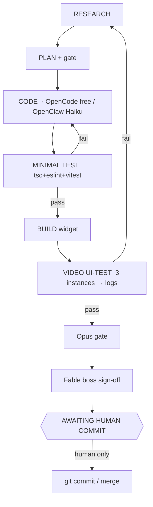

# ENGINEERING LOOP — the autonomous code→test→review machine

> **Transport update (2026-08-06):** this loop now runs **over Slack** — see
> [[SLACK-ORCHESTRATION]] for the channel map, per-agent bot tokens, message protocol,
> and the loop-until-**≥98%-vs-FittingBox** exit condition. The stages/roster/model-map
> below are unchanged; Slack is the new dispatch + shared-memory layer.

The **build** counterpart to the research loop ([[LOOP-ENGINEER]] = the validation gate,
[[Loop Protocol Spec]] = the automation contract, [[System Flow]] = the diagrams).
Goal: research → code → minimal test → build → **video UI-test** → review runs
**autonomously, cron-driven**; the **human only commits/merges, resolves critical
bugs, and makes new decisions.** Reuses the existing machinery — nothing here
reinvents the gate, the kanban, or the cron configs.

## Agent roster + canonical model map

> This table is the **single source of truth** for model routing. Where older docs
> disagree ([[Loop Protocol Spec]], [[System Flow]], souls), THIS wins.

| Agent | Role | Runs via | Model | Tier |
|---|---|---|---|---|
| **Hermes** | Orchestrator (evolving memory): assign, track, decide, mirror board | hermes gateway | `deepseek/deepseek-v4-pro` (OpenRouter) | cheap |
| **OpenCode-Fetch** | web research / fetch / scrape | opencode CLI | `opencode/big-pickle` | FREE |
| **OpenCode-SimpleCoder** | boilerplate, scaffolds, **new files**, simple edits | opencode CLI | `opencode/big-pickle` | FREE |
| **OpenClaw-Coder** | complex coding | openclaw (claude-cli) | `claude-haiku-4-5` | cheap Claude |
| **Opus-Gate** | per-change analysis + code review (gate Stage 2) | `validate.ps1` / `claude -p` | `claude-opus-4-8` | premium |
| **Fable-Boss** | final holistic sign-off before human | `claude -p --model claude-fable-5` | `claude-fable-5` | premium |
| **TestRunner** | tsc + eslint + vitest (no LLM) | shell | — | free |
| **VideoUITester** | play 3 videos as fake camera, capture logs | Playwright + shell | — | free |
| **Research agents ×11** | research phase ([[VTO-Agents]] briefs) | OpenClaw sub-sessions + OpenCode | deepseek-flash / free | cheap |

**Token rule (enforced):** free models scrape + scaffold; Haiku does complex code;
**Opus + Fable only review; Hermes only orchestrates.** Claude/Opus/Fable tokens are
never spent on fetching or bulk coding.

## The loop (8 stages)

1. **RESEARCH** (auto) — Hermes fires research agents → findings → gate (Catalyst/Haiku → Opus).
2. **PLAN** (auto) — Hermes compiles a candidate → `validate.ps1 -Depth deep` → APPROVED plan → build tasks.
3. **CODE** (auto) — OpenCode-SimpleCoder (free) for simple/new files, OpenClaw-Coder (Haiku) for complex. **Conflict rule: create a NEW file (e.g. `FooV2.ts`) rather than editing; Hermes records the swap so nothing working is corrupted.**
4. **MINIMAL TEST** (auto) — `tsc -b` + eslint + `vitest run`. Fail → back to CODE (or RESEARCH if design-level).
5. **BUILD** (auto) — `pnpm --filter @nmg-vto/vto-widget build` (exactly one shell chunk).
6. **VIDEO UI-TEST** (auto) — [[VIDEO-TEST]] harness feeds no-glasses / clear / sunglasses videos as a fake webcam, runs try-on, captures **logs only** (`[vto] seg:`, removalStatus, applied/blocked, errors). Fail → **RESEARCH → CODE → redo.**
7. **REVIEW** (auto) — Opus gate (per change) → Fable boss holistic sign-off → an `AWAITING HUMAN COMMIT` report.
8. **HUMAN** — git commit/merge · critical bugs · new decisions. **Nothing else needs a human.**

## Autonomy — fully cron-driven (unattended)

Per [[F011 orchestration-automation]], the human dispatcher is replaced by pollers:
- **`vto-poll-assigned`** (OpenClaw, ~5 min) — picks up `assigned` build tasks, codes them.
- **`vto-review-done`** (Hermes, ~10 min) — reviews `done` tasks, assigns next, compiles candidates → gate.
- **`vto-eng-verify`** (new, after CODE) — runs TestRunner → BUILD → VideoUITester → Opus/Fable.
- **`vto-staleness-monitor`** (~2 h) — watchdog; reclaims stalled workers.

Installed as Hermes/OpenClaw cron jobs and added to the Agent OS autostart so the loop
survives reboots. **Kanban difference vs the research board:** here build/test/video cards are
**auto-assigned** (cron-driven) — the human gate moves from *card assignment* to the terminal
`AWAITING HUMAN COMMIT` card, which is created `blocked(needs_input)` so the loop halts there.

## Hard rules (never violated)

- **git commit/push is NEVER automated.** The loop always ends at the human commit gate.
- **New files over edits on heavy conflict** — don't corrupt working code; Hermes tracks the swap and retires the old file only after the new one is APPROVED.
- **Attempt cap = 2** on same-theme rework → escalate to `blocked(needs_input)` for the human ([[Loop State Machine]]).
- **Camera tests run LOCALLY** (F010: no cloud farm injects a webcam).
- **All VTO code lives in `nmg-vto\rkumar-vto`** ([[code-in-rkumar-vto]]).
- **A validated replacement becomes PRIMARY**, never an add-on ([[primary-not-additive]]).

## Related
[[LOOP-ENGINEER]] · [[Loop Protocol Spec]] · [[Loop State Machine]] · [[System Flow]] · [[VIDEO-TEST]] · [[SOUL-Hermes]] · [[SOUL-OpenClaw]] · [[SOUL-OpenCode]] · [[SOUL-Opus]] · [[SOUL-Fable]] · [[VTO]] · [[VTO-Agents]]
