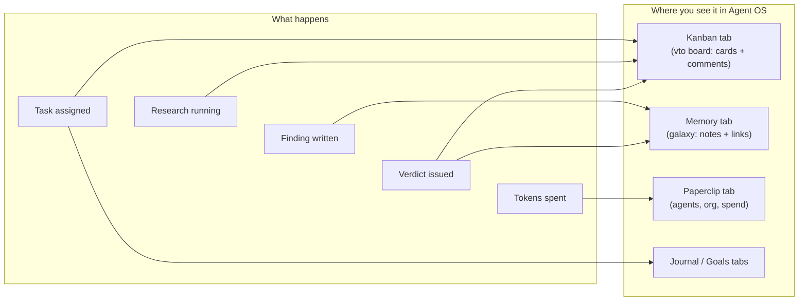
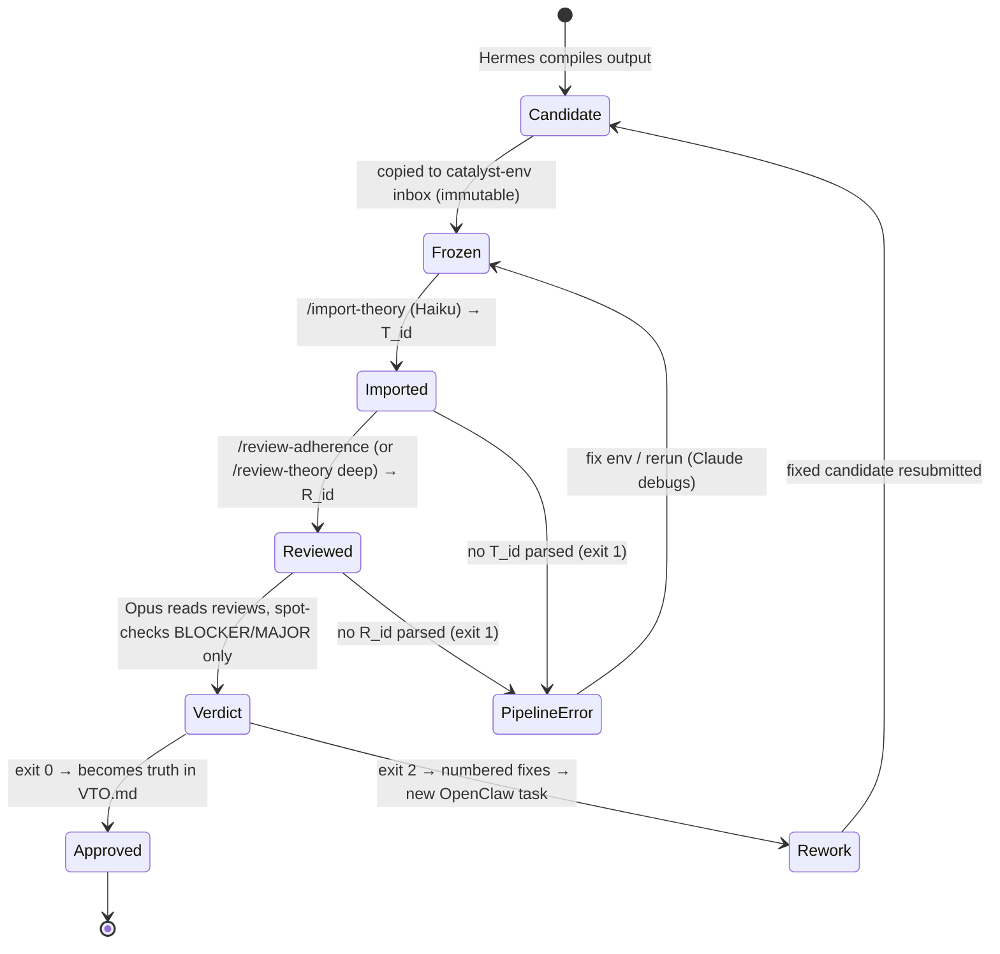

# System Flow — what happens when Rohit gives a feature command

Example command: **"Improve the frame detection and frame removal feature in the VTO with the help of researcher agents and data collected, and apply to codebase."**

The command flows through 6 stages. Every stage writes to the vault and mirrors to the **vto kanban board**, so the Agent OS dashboard shows it live ([[LOOP-ENGINEER]] = validation contract, [[VTO Agent Architecture]] = task protocol, [[Loop Protocol Spec]] = automation contract).

## 1 · Master flow (happy path + main loops)

```mermaid
flowchart TD
    CMD["Rohit gives the command<br/>(to Claude terminal or Hermes)"] --> ENTRY["Claude loads memory + VTO context,<br/>hands orchestration to Hermes"]
    ENTRY --> H1["HERMES reads SOUL + VTO.md + existing findings.<br/>Picks researchers for frame detection/removal:<br/>FittingBox · Patent · Software · Rendering · Testing"]
    H1 --> T1["Creates task notes T-NNN (status: assigned)<br/>+ UNASSIGNED cards on vto kanban board"]
    T1 --> OC1["OPENCLAW picks up assigned tasks<br/>(comments IN PROGRESS on cards)"]
    OC1 --> SW["Spawns research sub-sessions<br/>(sessions_spawn, max 3 parallel)"]
    SW --> D1{"Mission needs<br/>web scraping?"}
    D1 -- "yes" --> OCODE["Delegate to OPENCODE CLI<br/>free big-pickle model → output file<br/>(zero Claude tokens)"]
    D1 -- "no" --> AN
    OCODE --> AN["Analyze data with Claude tokens<br/>(reasoning only, never fetching)"]
    AN --> F1["Findings F-NNN written to vault<br/>(cited evidence) · cards commented DONE"]
    F1 --> H2["HERMES absorbs findings,<br/>cross-links contradictions,<br/>compiles ONE candidate plan"]
    H2 --> FTO{"Patent FTO check —<br/>Fittingbox holds ~16<br/>frame-removal patents"}
    FTO -- "infringes" --> DA["Design-around task<br/>back to research"] --> OC1
    FTO -- "clear / designed around" --> GATE["VALIDATION GATE<br/>validate.ps1 -Depth deep"]
    GATE --> CAT["Stage 1: Catalyst adversarial review<br/>(Haiku — cheap fault-finding)"]
    CAT --> OPUS["Stage 2: Claude Opus final verdict<br/>(single pass over the review)"]
    OPUS -- "REWORK (exit 2)" --> RW["Numbered fixes copied into<br/>new task for OpenClaw"] --> OC1
    OPUS -- "APPROVED (exit 0)" --> TRUTH["Plan becomes truth in VTO.md<br/>(verdict file cited)"]
    TRUTH --> H3["HERMES splits plan into build tasks<br/>(small, checkable definition of done)"]
    H3 --> OC2["OPENCLAW implements in<br/>shopify/nmg-vto codebase"]
    OC2 --> TEST{"Tests + budget gates:<br/>client-side only · GLB ≤ 3MB / 50k tris ·<br/>widget ≤ 250KB gz · jitter metrics"}
    TEST -- "fail" --> RW2["rework note on task"] --> OC2
    TEST -- "pass" --> GATE2["Gate again (standard depth)<br/>on the change write-up"]
    GATE2 -- "REWORK" --> OC2
    GATE2 -- "APPROVED" --> APPLY["⚠ HUMAN CHECKPOINT:<br/>Rohit reviews the git diff —<br/>agents do NOT push/commit unreviewed"]
    APPLY --> DONE["Task notes done · kanban cards done ·<br/>journal + memory updated · goal ticked"]
```

## 2 · Where every step is visible (dashboard mirror)

## 3 · Validation gate (state machine)

## 4 · Model & token fallback ladder (who pays what)

```mermaid
flowchart TD
    subgraph OpenClaw["OpenClaw (executor)"]
        A1["claude-opus-4-8 via Claude CLI<br/>(subscription pool)"] -- "limit hit" --> A2["ollama/minimax-m3:cloud (free)"]
    end
    subgraph OpenCode["OpenCode (scraper)"]
        B1["opencode/big-pickle<br/>(free, high limit)"] -- "rate limited / down" --> B2["ollama/minimax-m3:cloud (free)"] -- "ollama down" --> B3["qwen2.5-coder:14b (local)"]
    end
    subgraph Hermes["Hermes (orchestrator)"]
        C1["minimax-m3:cloud (free, 524k ctx)"]
    end
    subgraph Gate["Validation gate"]
        D1["Haiku (review — cheap)"] --> D2["Opus (verdict — one pass)"]
    end
    note["Rule: Claude/Opus tokens = reasoning + validation only.<br/>Fetching/scraping is always free-model work."]
```

## 5 · Edge cases & how the system handles them

```mermaid
flowchart TD
    subgraph Research["Research stage"]
        E1["Scrape blocked<br/>(robots / ToS / Cloudflare)"] --> S1["Respect ToS → browser tool for public demos,<br/>else finding flags 'requires external verification'"]
        E2["Findings contradict each other"] --> S2["Hermes cross-links both, fires follow-up task<br/>or /room Mastermind for multi-model judgment"]
        E3["More missions than capacity"] --> S3["Max 3 parallel sub-sessions — rest queue"]
        E4["Sub-session dies / returns nothing"] --> S4["Task note marked rework, never silently dropped"]
    end
    subgraph Kanban["Board / automation"]
        E5["Card accidentally ASSIGNED"] --> S5["Dispatcher auto-executes it!<br/>Standing rule: mirror cards stay unassigned;<br/>dry-run proven: unassigned = skipped"]
        E6["Auto-decomposer grabs a triage card"] --> S6["Happened 2026-08-04: it specs + decomposes within minutes.<br/>Held cards stay unassigned until Rohit unblocks"]
    end
    subgraph GateEdge["Validation"]
        E7["Reviewer wrong (false BLOCKER)"] --> S7["Opus can overrule — it spot-checks<br/>review findings independently"]
        E8["Endless REWORK ping-pong"] --> S8["Each rework = new numbered task with<br/>acceptance criteria; Rohit sees loop on board<br/>and can intervene any time"]
        E9["Catalyst env broken (deps/db)"] --> S9["exit 1 ≠ rework — Claude debugs env,<br/>candidate unchanged in inbox"]
    end
    subgraph Code["Apply-to-codebase stage"]
        E10["Change breaks perf/size budget"] --> S10["Testing gate fails → rework;<br/>budgets are hard numbers in GUIDANCE.txt"]
        E11["Approach touches Fittingbox patent"] --> S11["Patent-Researcher FTO check happens<br/>BEFORE the plan is approved — design-around loop"]
        E12["Repo docs conflict"] --> S12["CLAUDE.md + Decisions.md are ground truth;<br/>README / .claude there are stale"]
        E13["Git push / deploy"] --> S13["Never automated — Rohit reviews the diff (human checkpoint)"]
    end
    subgraph Infra["Infrastructure"]
        E14["PC rebooted mid-work"] --> S14["Everything autostarts at logon (Startup + tasks);<br/>state lives in vault + kanban DB, not in chat sessions"]
        E15["A gateway/service is down"] --> S15["Start Agent OS Silent.ps1 is idempotent —<br/>rerun restores dashboard/OmniRoute/Paperclip"]
        E16["Claude subscription exhausted"] --> S16["OpenClaw falls back to free minimax;<br/>gate verdicts wait for pool reset (Opus not substitutable)"]
    end
```

## The one-paragraph answer

The command does **not** go straight to code. It becomes: Hermes fires the relevant research missions → OpenClaw executes them in parallel (scraping via free OpenCode, analysis on Claude) → findings land in the vault → Hermes compiles an improvement plan → the plan survives a patent FTO check and the two-stage validation gate (Catalyst-on-Haiku review, Opus verdict) → only the APPROVED plan is split into build tasks → OpenClaw edits `nmg-vto` under hard budget gates → the change write-up passes the gate again → **Rohit reviews the final diff** before anything is committed. Every step is visible live in the Kanban, Memory, Paperclip, Journal, and Goals tabs, and every failure path loops back as a numbered rework task instead of dying silently.

## Related

[[VTO]] · [[VTO Agent Architecture]] · [[LOOP-ENGINEER]] · [[Loop Protocol Spec]] · [[SOUL-Hermes]] · [[SOUL-OpenClaw]] · [[VTO-Agents]]
