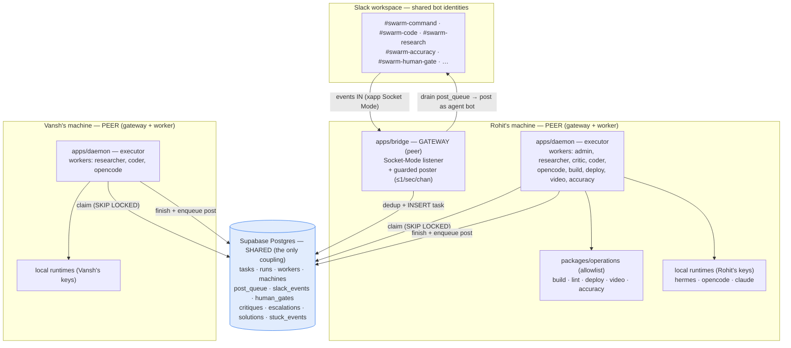
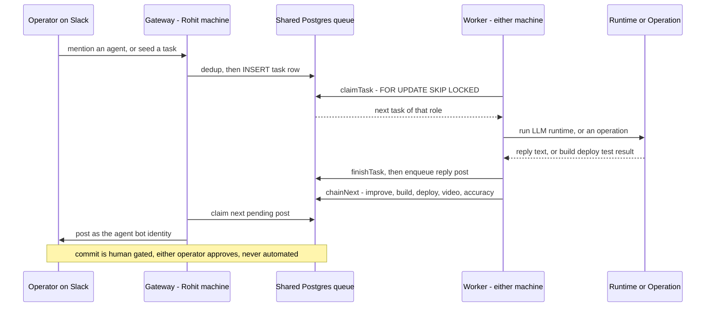
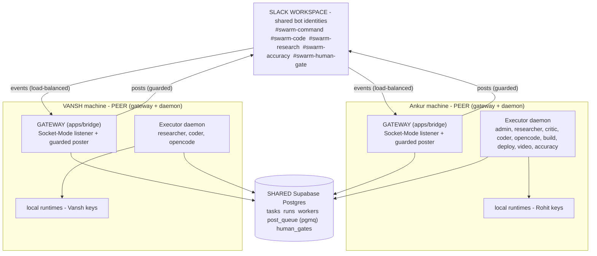
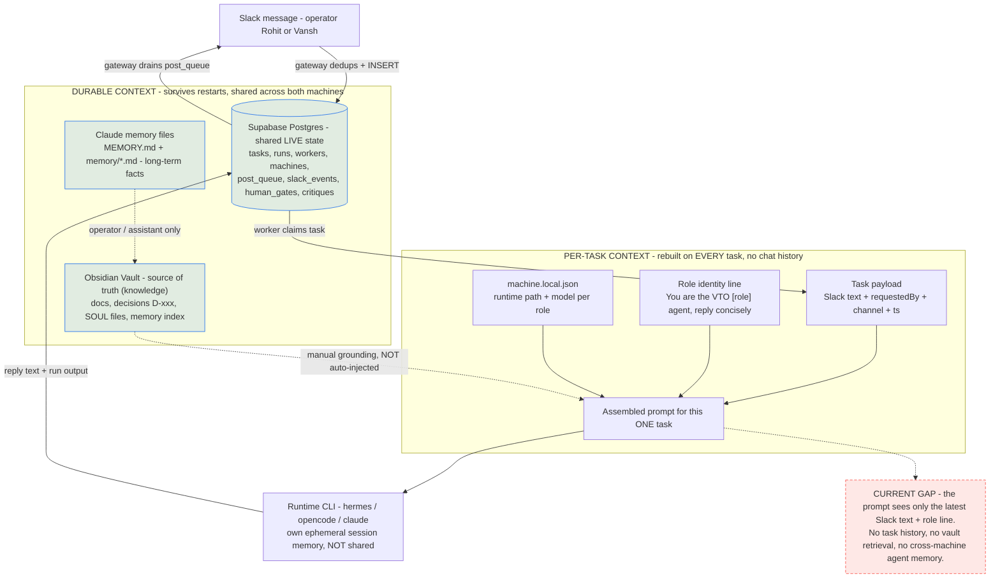

# VTO Agentic Orchestration — Current Structure (built + running)

Snapshot of what actually exists and runs today (2026-08-12). Design rationale + decisions live in
[[DISTRIBUTED-ARCHITECTURE]] (D-029..D-035) and [[TECHNICAL-ARCHITECTURE]] (TAD v3.0).

**In one line:** two machines share one Supabase Postgres; a single Slack **gateway** (Rohit's box)
turns messages into task rows; **executor daemons** on both machines pull role-matched tasks with
`FOR UPDATE SKIP LOCKED` (that's the cross-machine overflow), run a local **runtime** (LLM) or a
named **operation** (build/deploy/test), and post results back through the gateway.

## Topology



Both machines run a gateway as equal peers (**D-036**, supersedes D-030): Slack load-balances events
across the two Socket-Mode connections, and because both write to the one Postgres (with `slack_events`
dedup), the halves reunite into one complete stream. Outgoing posts are claimed one at a time
(`SKIP LOCKED`) and throttled per channel, so two concurrent posters never double-post. Workers never
open sockets — they coordinate only through Postgres. (See "Both operators, one Slack" below.)

## The loop (task lifecycle)



> The loop is role-matched, not machine-matched: any worker on either machine can claim the
> next task of its role (`SKIP LOCKED`), so a busy Rohit box silently overflows onto Vansh's.
> A code task can't be claimed until a passing critique row exists (D-005); the terminal commit
> step only ever writes a `human_gates` row — a human approves, the system never commits (D-008/D-034).

## Both operators, one Slack — dual peer gateways (D-036, supersedes D-030)

Both machines run the **same full stack** — gateway **and** daemon — as equal peers. Either
operator's Slack messages land directly in the one Postgres queue, and **no machine is a special
"host."** Slack load-balances events across the two Socket-Mode connections; because **both gateways
write to the same Postgres** (with `slack_events` dedup catching any retry overlap), the two halves
reunite into one complete stream — no event is lost. Outbound, both gateways drain `post_queue`
concurrently, made safe by two per-channel guards in `claimNextPost`: skip a channel that already
has a post *sending*, and skip one posted to within the last ~1.1s. So two posters never double-post
or exceed Slack's ~1/sec/channel limit — no leader, no lease.



**Reading it:** there is no gateway "host" — both machines listen to Slack and both post back,
coordinating only through the shared Postgres. Each Slack event reaches one gateway (load-balanced)
and is deduped on write; each reply is claimed by exactly one poster (`SKIP LOCKED`) and throttled
per channel. The only separation left is physical (two boxes) and functional (agents doing different
things) — exactly the goal.

## Context management (current state)

How context/state is captured, stored, and delivered to agents today — and, honestly, where it's thin.
There are **two kinds of context** and they behave very differently:

- **Durable context** (survives restarts, shared across both machines): the **Supabase Postgres**
  (live state — tasks/runs/workers/post_queue/human_gates/critiques), the **Obsidian Vault**
  (knowledge — docs, decisions D-xxx, SOUL files, the memory index), and the **Claude memory files**
  (long-term facts for the operator/assistant).
- **Per-task context** (rebuilt on *every* task, no chat history): when a worker claims a task it
  assembles a prompt from just the **task payload** (the raw Slack text + requestedBy/channel/ts), a
  one-line **role identity** ("You are the VTO <role> agent…"), and the machine's **runtime config**
  (which model per role). The runtime CLI (hermes/opencode/claude) then has its *own* ephemeral session
  memory that is **not** shared across machines or tasks.



**The honest gap (red):** an agent's prompt currently receives only the *latest* Slack message plus its
role line. Task history, prior runs, and the vault are **not** auto-retrieved into the prompt — grounding
in the vault is a manual/convention step, and each runtime's session memory is per-CLI and per-machine.
So state (what's happening) is well-managed in Postgres; *knowledge context* (what the agent should know
when it runs) is not yet assembled automatically. Closing this is the retrieval/summarization work.

## Components

| Component | Where | What it does |
|---|---|---|
| `packages/db` | shared lib | Pg data layer: the `SKIP LOCKED` claim, enqueue, worker/machine registry + heartbeats, serialized post queue, human-gate, stale recovery. |
| `apps/bridge` (gateway) | Rohit only | One Slack Socket-Mode listener → dedup → `tasks`; poster drains `post_queue` (≤1/sec/channel). |
| `apps/daemon` (executor) | both machines | Registers workers per role, claims tasks (capacity-gated), runs runtime or operation, writes the run, enqueues the reply, chains the loop. |
| `packages/operations` | shared lib | The allowlist — `build · lint · deploy · video · accuracy`. No arbitrary shell (D-006); git commit/push NOT here (D-008); prod deploy out (D-028). |
| Supabase Postgres | cloud (shared) | The single coordination store — 11 tables. |
| `config/machine.local.json` | per machine (git-ignored) | This machine's runtime binary paths, worker capacities, repo path, store creds. |

## Roles → runtime / operation

| Role | Kind | Backed by |
|---|---|---|
| admin, researcher | LLM | hermes · `deepseek/deepseek-v4-flash` |
| critic, coder | LLM | hermes · `qwen/qwen3-coder-flash` |
| opencode | LLM | opencode · `big-pickle` (free; falls back to OpenClaw/haiku when exhausted) |
| claude | LLM | claude · `opus-4-8` (judgment/review) |
| build, lint, deploy, video, accuracy | operation | `packages/operations` (shell, no LLM) |

## Autonomy & gates

- **Auto:** code → build → test → accuracy → **deploy to the DEV store** (D-033).
- **Human-gated:** git commit/push — halts at a `human_gates` row; **either** operator approves (D-034); the system records the approval, never performs the commit (D-008).
- **Pre-code critique gate (D-005):** a code task can't be claimed until a passing critique row exists.
- **Overflow (D-032):** one pool per role; a worker claims only with a free slot; first free worker on either machine wins — implicit, no hand-off messages.

## Status (2026-08-12)

- ✅ **pgmq queue (D-013 cont.) + dual peer gateways (D-036) — DONE + applied + proven (uncommitted).**
  Task claiming moved off `FOR UPDATE SKIP LOCKED` to **pgmq / Supabase Queues**: a claimed message is
  invisible for `SWARM_CLAIM_VT` (default 900s) and **auto-reappears if the worker crashes** (fixes tasks
  stranded in `running`). Migrations `0002` (created `workflow_runs`) + `0003` (pgmq + `vto_send/read/ack`)
  applied. Both machines now run a **gateway as equal peers**; `claimNextPost` gained per-channel guards so
  concurrent posters are safe. Verified: pgmq round-trip, crash-recovery (redelivery after vt), integration
  claim/ack, and the dual-poster guard all PASS. **Cutover pending:** both daemons/gateways must run this
  code (an old-code daemon double-claims; an old-code poster ignores the guards) — see the catch-up doc.
- ✅ Live + verified end-to-end: mention/seed → claim (with real cross-machine overflow) → runtime/op
  → Slack post → Supabase state → chain. A full run did `build → deploy (vto-phase1-80) → video + accuracy`.
- ✅ **Any operator can assign from Slack (fix 2026-08-12):** the gateway now resolves every agent bot's
  real Slack user-id at startup, so a normal `@`-mention of the bot (`<@U…>`) maps to its role — not just
  the literal `@vto-<role>` text. Also accepts `vto researcher …`, `!researcher …`, and a leading
  `researcher: …`. This is why Vansh's earlier mention got no reply — the encoded `<@U…>` never matched.
- ✅ **Escaped the connection-cap (fix 2026-08-12):** `SWARM_DATABASE_URL` now uses the **transaction**
  pooler (`:6543`) instead of the **session** pooler (`:5432`, hard-capped at 15 clients and NOT tunable).
  Per-process pool `max` also lowered (10→4, `SWARM_DB_POOL_MAX` override). *Vansh should switch his own
  `config/.secrets.env` to `:6543` too* — until then his daemon is the only user of the session pool.
- ⚠️ Known defects from the shakedown: (1) daemon **version skew** across machines breaks chaining until
  both re-pull; (2) op-persona bots (testrunner/videotester/accuracy) aren't in the channels yet — op
  results currently post as `admin`; (3) `deploy→video+accuracy` fan-out is parallel, so accuracy can
  score stale logs (should chain accuracy **after** video); (4) a **stale `opencode` worker** on Vansh's
  box (busy, heartbeat ~75 min old) — reclaimed by the staleness monitor or a daemon restart.
- 🔜 Next: commit/push the operations + chaining code (closes the version-skew gap), invite op bots,
  order accuracy after video, then wire the dispatcher's task decomposition + full recovery.
```
