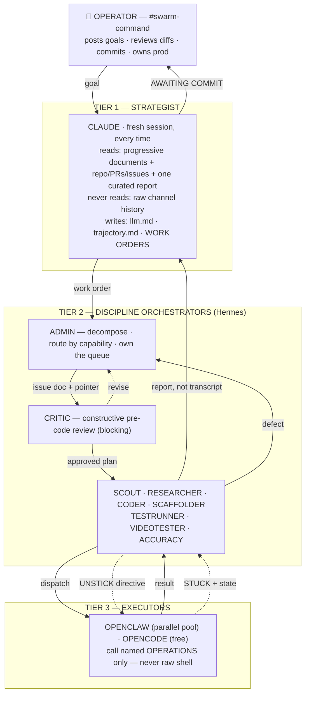
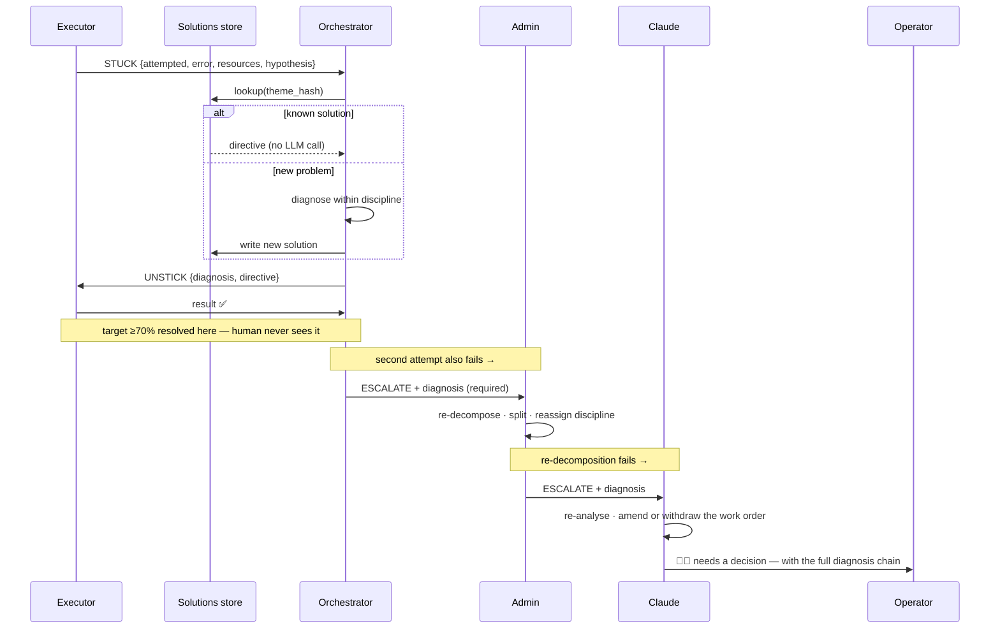

# PRD — VTO Autonomous Engineering Swarm

**Version 3.0** · Draft for review · 2026-08-08
**Supersedes:** [[SLACK-ORCHESTRATION]], [[ENGINEERING-LOOP]], [[AGENT-HIERARCHY]], and PRD v2.0.
**Rewritten from scratch.** v2.0 had the right tier structure and the wrong context strategy — it fed every tier the same firehose of channel history, which would have buried the strategist in execution noise. This version fixes that at the root: context discipline, progressive documents, a blocking pre-code critic, and document-mediated hand-off are designed in rather than patched on.

---

## 1. TL;DR

A three-tier multi-agent system that improves a Shopify eyewear virtual try-on product with minimal human involvement.

**Claude** analyses the codebase, maintains a set of living documents that describe it, finds gaps, and issues goal-level work orders. **Nine Hermes orchestrators** — Admin, Critic, Scout, Researcher, Coder, Scaffolder, TestRunner, VideoTester, Accuracy — each own one discipline: they decompose their slice, dispatch it, and diagnose their own executors when those executors stall. **OpenClaw and OpenCode** are the executor pool doing the actual work, many tasks in parallel.

Four disciplines hold it together, and they are the difference between having an orchestration tier and practising orchestration:

1. **Progressive documents.** Three living documents per codebase carry definitions, agent rules, and the full trajectory of what has been done and what is intended. They are the strategist's entire input.
2. **Tier-differentiated context.** Claude runs a *fresh session every single time*, fed only those documents plus one curated report. Executors get the full mess. The strategist never does.
3. **Constructive critique before code.** Every coding task passes a helpful-skeptic review first — risks *paired with alternatives*. Nothing gets built from optimism.
4. **Documents as the medium.** Hand-offs write a document and post a pointer. Coherence accumulates in artifacts, not in chat scrollback.

Everything is visible in Slack. The loop runs until measured accuracy against FittingBox reaches ≥0.98, then halts at a human commit gate. Git is never automated, and no failure is ever attributed to an agent.

---

## 2. Problem

### 2.1 Context

The VTO product ([[VTO]]) is a client-side eyewear try-on for Shopify — MediaPipe FaceLandmarker, three.js, GLB assets — competing with FittingBox. Its technical plan is validated (decision D3) and 26+ build tasks have shipped. The work is not blocked on knowing what to build. It is blocked on build throughput.

### 2.2 The problem

Every improvement cycle costs a human several hours of coordination: deciding what to work on, writing the task, watching the worker, noticing it stalled, diagnosing why, restating the task, running tests, reading logs, judging whether the result is good enough, and starting over. Intelligence is cheap and available. **Coordination is the bottleneck, and it is entirely human.**

Four failure modes make this expensive:

| Failure | Cost today |
|---|---|
| **Silent stalls.** A worker hits an unfamiliar error and loops, hallucinates progress, or stops. Nobody notices for hours. | Whole sessions lost. Six variants catalogued in [[F011 orchestration-failure-modes]]. |
| **Confident circling.** Worse than a stall: a worker fixes the same thing three ways, each time believing it succeeded. It never asks for help. | Silent waste, and a codebase quietly churned without progress. |
| **Context evaporation.** Work happens in disposable sessions. The next agent starts blind and re-derives what was already known. | Duplicated research, contradictory findings, re-litigated decisions. |
| **No stopping rule.** "Good enough?" is answered by opinion. | Work stops too early, or grinds past the point of value. |

### 2.3 Why now

The parts exist and are individually verified: four agent CLIs installed and heartbeat-tested (opencode 1.18.14, openclaw 2026.7.1-2, hermes v0.18.0, claude 2.1.216), an offline-verified Slack bridge with passing tests, a video-test harness that has already caught real bugs, and a validated technical plan. What is missing is the coordination layer that makes them one machine.

### 2.4 Why the obvious approach fails

Two failure patterns are well documented by operators running this architecture in production, and both are worth naming because the design below is shaped around avoiding them.

**Coding agents without an orchestration tier** produce large refactors. The agent optimises locally, drifts from intent, and nobody is holding the whole picture. Adding the tier is credited with saving 40–50% of turns.

**An orchestration tier without orchestration discipline** is nearly as bad — it just costs more. If the strategist is fed the same firehose as the executors, its context fills with stack traces and rejected diffs, and it degrades into an expensive log reader that defends its own earlier plan instead of re-evaluating it. This was the flaw in v2.0 of this document, corrected here.

---

## 3. Users and accountability

### 3.1 Primary user — the Operator

One technical person who owns the VTO product and is fluent in the codebase. Not a passive observer: they set goals, read channels, override verdicts, and are the only actor permitted to commit.

In steady state the Operator does three things:

1. Posts a goal in `#swarm-command`.
2. Reads `#swarm-accuracy` and `#swarm-human-gate` to see whether it is working.
3. Reviews a diff and commits it.

Their measure of success is **how rarely the system needs them**.

### 3.2 Named accountability — non-negotiable

> There is no such thing as "the agent did it." There is only a human who pushed code.

One named person owns, permanently and without delegation to any agent:

- **The commit.** Every merge is a human action.
- **The live state.** What is running in production, and whether it is healthy.
- **Production error states.** Every error path has a human owner, not a queue.

The system may prepare everything. It attributes nothing. If the swarm ships a regression, the owner shipped a regression. Automation does not dilute this rule, and treating it as diluted is exactly how unowned failures accumulate.

### 3.3 Secondary user — future teammates

Anyone who can read Slack can audit why any change was made, without being briefed. Anyone who can read `trajectory.md` can understand the project's whole history and direction in one pass. Both are deliberate design properties.

### 3.4 Explicitly not a user

External customers, other engineering teams, anyone outside the workspace. This is internal tooling: no onboarding, no billing, no multi-tenancy, none planned (§11).

---

## 4. Goals

| # | Goal | Evidence it happened |
|---|---|---|
| G1 | A goal posted in Slack becomes a reviewable, tested change with no human in between | ≥1 change reaches the human gate untouched |
| G2 | Stalled and circling executors recover without a human | ≥70% of recovery events resolved at Level 1 or 2 |
| G3 | Bad approaches are caught before code is written, not after | ≥1 in 3 critiques changes the plan before dispatch |
| G4 | Understanding compounds instead of being re-derived | A fresh session can state the project's history and direction from documents alone |
| G5 | The loop stops on a number, not an opinion | Accuracy published every loop; halt at ≥0.98 |
| G6 | Every decision is auditable after the fact | Any change traceable to its work order through Slack and documents alone |
| G7 | Continuous operation is affordable | Cost per merged change tracked and trending down |

---

## 5. System architecture

### 5.1 Three tiers



### 5.2 The agent roster

**Twelve agents.** One strategist, nine orchestrators, two executors.

| Tier | Agent | Owns | Executor | Reports to | Channel |
|---|---|---|---|---|---|
| 1 | **Claude** | Codebase analysis, document enrichment, gap-finding, work orders, re-planning | — | Operator | `#swarm-analysis` |
| 2 | **Admin** | Decomposing work orders into issue documents; capability routing; sequencing; the queue | — | Claude | `#swarm-admin` |
| 2 | **Critic** | Constructive pre-code review of every plan. **Blocking.** | — | Admin | `#swarm-critique` |
| 2 | **Scout** | Web fetch, scrape, capture | OpenCode + Playwright | Researcher, Admin | `#swarm-scout` |
| 2 | **Researcher** | Patent analysis, FittingBox teardown, API request/response analysis, backend inference | OpenClaw | Claude, Admin | `#swarm-research` |
| 2 | **Coder** | Feature implementation, complex edits, refactors | OpenClaw | Admin | `#swarm-code` |
| 2 | **Scaffolder** | Boilerplate, config, glue, new files | OpenClaw | Admin | `#swarm-scaffold` |
| 2 | **TestRunner** | `tsc`, `eslint`, `vitest`, build; error triage | OpenClaw | Admin (defect), Claude (design-level) | `#swarm-tests` |
| 2 | **VideoTester** | Try-on verification against pre-recorded clips | OpenCode + OpenClaw | **Claude** | `#swarm-video` |
| 2 | **Accuracy** | Scoring our try-on against FittingBox | OpenCode | **Claude** | `#swarm-accuracy` |
| 3 | **OpenClaw** | Complex execution — code, analysis | — | its dispatching orchestrator | (posts to dispatcher's channel) |
| 3 | **OpenCode** | Mechanical execution — fetch, shell, capture, scoring | — | its dispatching orchestrator | (posts to dispatcher's channel) |

**Critic is a separate agent, not a mode of Coder.** Two reasons: a reviewer that shares an identity with the author inherits the author's optimism, and the review runs on a cheap model at high frequency while coding does not. Separate agent, separate model, separate channel, separate record.

**Three routing rules**, stated explicitly because they are where naive designs go wrong:

- **Verification reports go *up* to Claude.** VideoTester and Accuracy produce information, not defects. "Accuracy is 0.94" might mean iterate or might mean the plan is wrong; only the strategist decides which.
- **Test failures go *sideways* to Admin.** A failing test is a known defect with a known fix path. Escalating it to Claude wastes the expensive tier on scheduling work.
- **Orchestrators report, they do not forward.** A bounded synthesis, never a transcript. The product owner writes the report; the CTO does not read the developer's terminal.

### 5.3 Three loops

**The document loop** (slowest, outermost). ANALYSE → ENRICH. Claude inspects the codebase and rewrites the progressive documents. Runs at work-order start, at loop end, and after any large refactor. This is the loop that makes understanding compound.

**The improvement loop** (outer). PLAN → DECOMPOSE → PRE-CODE → CODE → TEST → VIDEO → ACCURACY → REPORT → back to ANALYSE. Terminates on a number.

**The recovery loop** (inner). STUCK or detected circling → owning orchestrator diagnoses → executor retries. Cheap, fast, frequent, and invisible to the human when it works.

```
ANALYSE   Claude · fresh session · progressive documents only
   ↓
ENRICH    Claude rewrites llm.md + trajectory.md from what it just learned
   ↓
PLAN      work order — intent + evidence + acceptance criteria
   ↓
DECOMPOSE Admin → issue documents in docs/issues/, routed by capability
   ↓
PRE-CODE  Critic — constructive review · BLOCKING · nothing dispatches without it
   ↓
CODE → TEST → VIDEO → ACCURACY
   ↕
   └── recovery loop: STUCK declared, or circling detected → diagnose → unstick
   ↓
REPORT    orchestrator writes a synthesis
   ↓
back to ANALYSE — fresh session, enriched documents
```

---

## 6. Core mechanisms

### 6.1 Progressive documents

Three living documents per codebase, in the repo. They are the memory of the system and the entire input to the strategist.

| Document | Contents | Written by | Read by |
|---|---|---|---|
| **`llm.md`** | Definitions: modules, entry points, data flow, vocabulary, invariants, what each part is *for* | Claude (ENRICH) | All tiers |
| **`CLAUDE.md`** | Operating rules for coding agents. **Points at the other two** so they are re-read continuously | Human + Claude | Tiers 2 and 3 |
| **`trajectory.md`** | Full history — what has been done and why — plus all future goals, open issues, merged PRs, refactor analyses | Claude (ENRICH) | **Tier 1 primarily** |

`trajectory.md` is the load-bearing one. It is what lets a session with no memory make an organisation-level decision: everything intended and everything done, readable in one pass, with none of the code's mess.

**The ENRICH stage** is what keeps them true. After analysing, Claude rewrites `llm.md` and `trajectory.md` with what it just learned — new modules, resolved issues, merged PRs, changed direction. Without this stage the documents rot and the fresh session becomes amnesia.

### 6.2 Context discipline

Different tiers need opposite things. Applying one policy to all three is the mistake that hollows out the strategist.

| Tier | Session | Receives | Never receives |
|---|---|---|---|
| **1 — Claude** | **Fresh, every invocation, no exception** | Progressive documents · repo, PR and issue read access · **one curated report** | Raw channel history |
| **2 — Orchestrators** | Fresh per task | Task thread · own-discipline history · the relevant progressive document | Other disciplines' noise |
| **3 — Executors** | Fresh per run | Everything: full thread, prior attempts, errors, diffs | — |

**Why the strategist gets a fresh session every time.** A long-running session accumulates the biases of everything it has seen; it stops re-evaluating the plan and starts defending it. Freshness is not a cost-saving measure, it is what preserves judgment.

**The report, not the transcript.** Orchestrators must synthesise: what was attempted, what was learned, what decision is needed. Three paragraphs, not three hundred messages.

### 6.3 The work order — Claude → Admin

Claude's only output artifact. Deliberately not a task list; decomposition belongs to Admin.

```
[W014 · loop 3] Claude — WORK ORDER
INTENT:      Sunglasses are blocked only 43% of the time; the block/remove
             decision oscillates frame to frame.
EVIDENCE:    #swarm-video 2026-08-08 — sunglasses clip, peakP=0.98 but the
             verdict flips 11 times post-warmup.  trajectory.md §D3.2.
ACCEPTANCE:  sunglasses → BLOCKED ≥95% of post-warmup frames, ≤1 flip.
CONSTRAINTS: no new model downloads; must not regress clear→applied.
→ docs/work-orders/W014.md   ·   @VTO-Admin decompose
```

### 6.4 The issue document — Admin → Critic → orchestrator

Admin is the **single writer** to the queue. Concurrent task creation caused the duplicate-research waste already documented in [[F011 orchestration-failure-modes]] FM-1.

Admin writes a file, not a message:

```markdown
<!-- docs/issues/T037.md -->
# T037 — Sticky-block hysteresis for the removal verdict
work_order: W014 · capability: code.implement · depends_on: [T036]

## Goal
Suppress verdict flicker on the sunglasses path.

## Definition of done
- [ ] hysteresis window configurable, default 5 frames
- [ ] unit test covers flip suppression
- [ ] tsc + eslint clean
- [ ] error states fully kitted per docs/standards/fully-kitted.md

## Context
packages/vto-core/src/engine/landmark-debug-engine.ts
```

Slack carries only: `[W014/T037 · stage=PRE-CODE] Admin — T037 ready → docs/issues/T037.md @VTO-Critic`

**Documents are the payload; Slack is the pointer.** A hundred messages do not accumulate into understanding; a document does. This also enables the cheapest recovery move in the system: after an orchestrator revises a plan, the executor is told to **re-read the document** rather than being re-prompted with fresh context. One authoritative version of the truth, not N paraphrases scattered across threads.

### 6.5 The Constructive Critic — PRE-CODE, blocking

Every coding task is reviewed before it is dispatched. No exceptions, no skip flag.

**The mode is the whole point.** A pure adversary lists everything wrong and produces a plan too conservative to be worth building — it lacks optimism about solutions. A helpful skeptic surfaces what will not work *in a form that moves the work forward*.

> **The rule:** every risk raised must be paired with a viable alternative. A criticism without a path forward is not useful and will be rejected. Do not reject an approach wholesale unless you can say what to do instead.

The Critic checks four things:

1. **Will this approach actually work?** Against the codebase as `llm.md` describes it.
2. **What breaks?** Regression surface, and what to do about it.
3. **Is it fully kitted?** Error states handled and reported, logging sufficient to diagnose, no silent catches, no unknown states — per `docs/standards/fully-kitted.md`.
4. **Is there a known solution?** Query the solutions store (§6.8) before anyone writes code.

Output is `APPROVED`, `APPROVED WITH NOTES`, or `REVISE` with concrete alternatives. `REVISE` returns to Admin, never to the executor.

**Why this is a must-have and not a refinement.** Without it an agent codes from optimism, and optimism is the origin of most downstream rework. Catching a wrong approach costs one cheap model call; catching it after implementation costs a full loop.

**This is not the same as refutation.** The vault's refuter ([[F011 orchestration-adversarial-review]]) proves stated facts wrong against their evidence — the correct instrument for verifying *research findings after the fact*, and the wrong one for reviewing a *plan before coding*. Two different jobs; the system runs both, in different places.

### 6.6 The STUCK protocol

An executor that cannot proceed declares it, with state, to the orchestrator that dispatched it.

**Why per-discipline.** The dispatching orchestrator is the only agent with both the domain model and the task history to diagnose. "Stuck while writing code" is a different problem from "stuck while scraping a page," and a generic supervisor can only offer a generic retry.

**A STUCK must carry state, not a complaint.** Four required fields:

| Field | Why |
|---|---|
| What was attempted | The orchestrator needs to not suggest it again |
| Verbatim error or blocking condition | Paraphrased errors are undiagnosable |
| Resources touched | Files, URLs, commands — the blast radius |
| The executor's own hypothesis | Often right, and cheap to check |

A declaration missing any field is **rejected and re-requested** — not escalated. An orchestrator cannot diagnose a shrug.



### 6.7 Circularity detection

The dangerous failure is not an executor that knows it is stuck. It is one **confidently going in circles** — fixing the same thing three ways, each time believing it succeeded. That executor never declares STUCK, so a self-report-only system never catches it.

The dispatcher therefore runs its own detector on every completed run, independent of what the executor claims:

| Signal | Trigger |
|---|---|
| **Repeat signature** | Same problem theme recurs across 3 runs in one work order |
| **File churn** | Same file touched in ≥3 consecutive runs with no verification passing |
| **Verification oscillation** | A test flips fail → pass → fail across runs |
| **No progress** | 3 runs, zero net movement on the definition of done |

Any trigger writes a system-declared stuck event and enters the normal ladder. The rule of thumb it encodes: *if the same problem resurfaces after two or three turns, stop coding and step up*.

### 6.8 Escalation ladder

| Level | Handler | Resolves | Cap |
|---|---|---|---|
| 0 | Executor self-retry | Transient — network, lock, rate limit | 1 |
| 1 | Owning orchestrator | Domain problems — wrong approach, missing context, bad framing | 2 |
| 2 | Admin | Decomposition problems — task too big, wrong discipline, missing dependency | 2 |
| 3 | Claude | Plan problems — the work order was wrong | 1 |
| 4 | Operator | Everything else | — |

Caps count **per theme**, not per message: rephrasing the same failing approach twice does not buy a third attempt. Every escalation must state **why this level could not resolve it**. An escalation without a diagnosis is a bug, and the system rejects it.

### 6.9 The solutions store

Every resolved recovery becomes a reusable record: problem signature, diagnosis, directive, and how often reusing it worked.

The stuck engine consults it **before** any model call. A hit applies the known directive and skips diagnosis entirely; a miss invokes the orchestrator and writes a new record on resolution. A record whose reuse success rate falls below 0.5 stops being served and is re-diagnosed.

This is cost control and institutional memory in one mechanism. It is also the corpus that makes circularity detection smarter over time.

### 6.10 Operations, not shell

Executors do not compose commands. They name an operation from a fixed set, and the system runs one fixed implementation:

`build.widget` · `test.unit` · `test.types` · `lint` · `video.run` · `accuracy.score` · `fetch.page` · `repo.diff` · `repo.pr` · `deploy.dev`

**Why an allowlist rather than a denylist.** A denylist enumerates what is forbidden and permits everything an agent can invent. The most frequent breakage in this architecture is implementation inconsistency — an agent blows its context and reaches for the wrong call — and a denylist does nothing about that. An allowlist makes the wrong thing *inexpressible*.

Every operation has one implementation, one place to fix, one place to log. Raw shell survives only behind an explicitly flagged operation, disabled by default, never available to Tier 3. The git denylist stays as defence in depth.

### 6.11 Slack — the bus, the log, and the human interface

Every interaction is a channel message. No direct messages between agents, no side channels. This costs latency and rate-limit budget; it buys complete auditability and a human able to interrupt anywhere.

**Fourteen channels.**

| Channel | Purpose | Posters |
|---|---|---|
| `#swarm-command` | Human ↔ Claude. Goals in, digest out. Scoreboard. | Operator, Claude |
| `#swarm-analysis` | Codebase analysis, gap findings, work orders | Claude |
| `#swarm-docs` | Progressive-document changes; ENRICH output | Claude |
| `#swarm-admin` | Decomposition, the queue, routing decisions | Admin |
| `#swarm-critique` | Pre-code reviews and verdicts | Critic |
| `#swarm-scout` | Fetch and scrape results | Scout |
| `#swarm-research` | Patent, FittingBox, API-behaviour findings | Researcher |
| `#swarm-code` | PR links, old-vs-new contrast | Coder |
| `#swarm-scaffold` | New files, boilerplate | Scaffolder |
| `#swarm-tests` | Test and build results, triage | TestRunner |
| `#swarm-video` | Per-clip try-on verdicts | VideoTester |
| `#swarm-accuracy` | **The number.** Score, trend, FittingBox delta | Accuracy |
| `#swarm-human-gate` 🔒 | AWAITING COMMIT cards; decisions needed | Claude, Operator |
| `#swarm-incidents` | Errors, cap breaches, watchdog, circling alerts | any |

**Message protocol.** First line is machine-parseable:
`[W014/T037 · loop 3 · stage=CODE · attempt 2] @VTO-Coder`

Threads hold a task's diary. Re-runs **quote the failing message** so causality is explicit. Emoji carry state: 👀 picked up · ✅ passed · ❌ failed · 🔄 redo · ⛔ stuck · 🌀 circling detected · 🚦 at gate · 🧑‍⚖️ needs human.

### 6.12 The human gate

The loop halts, permanently, at `#swarm-human-gate`. The Operator sees the diff, tests, video verdicts and accuracy proof, reacts ✅, and commits by hand.

**Git is never automated.** Commit, push and merge are blocked before any process spawns, regardless of which agent asked. One agent instructing another to run git is an incident, not a request.

---

## 7. Features

**M = must-have for v1** · **N = nice-to-have** (built only after every M ships)

### 7.1 Context discipline

| # | Feature | Class | Notes |
|---|---|---|---|
| F1.1 | Progressive documents — `llm.md`, `CLAUDE.md`, `trajectory.md` | **M** | The artifact that makes a fresh session useful |
| F1.2 | ENRICH stage — Claude rewrites definitions and trajectory | **M** | How coherence compounds instead of being re-derived |
| F1.3 | Tier-differentiated context policy | **M** | Tier 1 fresh session, documents only; Tier 3 everything |
| F1.4 | Report-up — orchestrators synthesise, never forward | **M** | Keeps the strategist's input clean |
| F1.5 | Documents as payload, Slack as pointer | **M** | Enables "re-read" instead of re-prompt |
| F1.6 | Document version and read-state tracking | **M** | Knowing whether an agent read the current version |
| F1.7 | Automatic document-rot detection | N | Manual ENRICH cadence covers v1 |

### 7.2 Orchestration

| # | Feature | Class | Notes |
|---|---|---|---|
| F2.1 | Claude codebase analysis → gap identification | **M** | The entry point |
| F2.2 | Work orders with intent + evidence + acceptance criteria | **M** | Acceptance criteria make "done" checkable |
| F2.3 | Admin decomposition into routed issue documents | **M** | |
| F2.4 | Single-writer queue discipline | **M** | Prevents FM-1 duplicate work |
| F2.5 | Capability-based routing | **M** | Adding an agent must not edit Admin |
| F2.6 | Dependency sequencing between tasks | **M** | A task waits until named parents are done |
| F2.7 | Claude re-planning on verification reports | **M** | Closes the outer loop |
| F2.8 | Parallel work orders in flight | N | Serial first; concurrency multiplies failure modes |
| F2.9 | Priority and cost-aware scheduling | N | Needs cost data v1 produces |

### 7.3 Pre-code review

| # | Feature | Class | Notes |
|---|---|---|---|
| F3.1 | Constructive Critic as a blocking PRE-CODE stage | **M** | No coding task dispatches without a verdict |
| F3.2 | Every risk paired with a viable alternative | **M** | The rule that keeps critique from becoming paralysis |
| F3.3 | Fully-kitted checklist enforced in the critique | **M** | Error states and logging standards checked before coding |
| F3.4 | Solutions-store lookup during critique | **M** | Cheapest possible reuse point |
| F3.5 | Refuter for research findings | N | Different job; post-hoc; findings only |
| F3.6 | Multi-lens critique panel | N | One good critic first |

### 7.4 Execution

| # | Feature | Class | Notes |
|---|---|---|---|
| F4.1 | Parallel executor pool with claim-lock + heartbeat | **M** | |
| F4.2 | Operations allowlist — the only path outward | **M** | Makes the wrong call inexpressible |
| F4.3 | Git denylist as defence in depth | **M** | Safety-critical backstop |
| F4.4 | Cost-tiered routing: free mechanical, paid judgment | **M** | Affordability constraint, not an optimisation |
| F4.5 | New-file-over-risky-edit on hard conflict | **M** | Prevents corrupting working code |
| F4.6 | Playwright-backed fetch for JS-heavy pages | **M** | Scout is useless without it |
| F4.7 | Executor version pinning + startup drift check | **M** | Upgrading a working CLI reliably introduces debt |
| F4.8 | Executors open PRs with descriptive comments | **M** | Gives the strategist a repo-native view |
| F4.9 | Automatic provider fallback | N | Manual reassignment is fine at v1 volume |
| F4.10 | Worktree isolation per executor | N | Only when concurrent edits actually collide |

### 7.5 Recovery

| # | Feature | Class | Notes |
|---|---|---|---|
| F5.1 | STUCK declaration with four required state fields | **M** | Enforced structurally, not by prompt |
| F5.2 | Per-orchestrator diagnosis and UNSTICK directive | **M** | The core differentiator |
| F5.3 | Circularity detector — four independent signals | **M** | Catches the executor that never asks for help |
| F5.4 | Five-level escalation ladder with per-theme caps | **M** | |
| F5.5 | Escalation must carry a diagnosis | **M** | One line; prevents blind hand-offs |
| F5.6 | Heartbeat + watchdog reclaim of dead slots | **M** | Stuck and dead need opposite responses |
| F5.7 | Solutions store with lookup-before-model | **M** | Cost control and institutional memory |
| F5.8 | Semantic similarity search over solutions | N | Exact matching first; add vectors only if too narrow |
| F5.9 | Cross-discipline stuck consultation | N | Not on the critical path |

### 7.6 Verification

| # | Feature | Class | Notes |
|---|---|---|---|
| F6.1 | TestRunner: types, lint, unit, build, with triage | **M** | |
| F6.2 | Test failure routes to Admin with the error attached | **M** | |
| F6.3 | VideoTester: clips through fake camera, log capture | **M** | |
| F6.4 | Accuracy: composite score vs FittingBox every loop | **M** | Without it there is no stopping rule |
| F6.5 | Graceful degradation when reference frames are missing | **M** | Report active terms; never overstate |
| F6.6 | Fully-kitted standard document | **M** | The thing F3.3 checks against |
| F6.7 | Perceptual terms (LPIPS/SSIM) active | N | Blocked on capturing FittingBox references |
| F6.8 | Automated regression suite across past fixes | N | |

### 7.7 Slack layer

| # | Feature | Class | Notes |
|---|---|---|---|
| F7.1 | One bot identity per agent | **M** | Log readability is the point |
| F7.2 | Parseable header + threading by task | **M** | |
| F7.3 | Tier-aware context assembly | **M** | Implements F1.3 |
| F7.4 | Emoji state machine | **M** | Cheapest status surface |
| F7.5 | Human gate channel + ✅ commit ritual | **M** | |
| F7.6 | Bridge watchdog + auto-restart | **M** | Single point of failure must self-heal |
| F7.7 | Live scoreboard canvas | N | Pinned message covers v1 |
| F7.8 | Firehose mirror channel | N | Rate-limit risk, marginal value |
| F7.9 | Slash commands | N | @mentions suffice |

### 7.8 Observability

| # | Feature | Class | Notes |
|---|---|---|---|
| F8.1 | Per-task metrics: duration, tokens, attempts, outcome | **M** | |
| F8.2 | Recovery event log with resolution level | **M** | Measures the primary bet directly |
| F8.3 | Operations transaction log | **M** | The audit surface for the middleware |
| F8.4 | Kill switch — pause the swarm from Slack | **M** | Non-negotiable for autonomous spend |
| F8.5 | Daily cost cap that auto-pauses | **M** | |
| F8.6 | Cost dashboard and trend charts | N | Queries cover v1 |

---

## 8. User flows

### 8.1 Happy path — the flow that must work

1. **Operator** posts in `#swarm-command`: *"Sunglasses should block reliably."*
2. **Claude** opens a **fresh session**, loads `llm.md` + `trajectory.md` + repo/PR/issue access. Analyses. Posts the gap to `#swarm-analysis`.
3. **Claude ENRICHes** — rewrites `llm.md` and `trajectory.md` with what it just learned. Posts the diff to `#swarm-docs`.
4. **Claude** writes `docs/work-orders/W014.md` and tags Admin.
5. **Admin** decomposes into `T036` (research → Researcher) and `T037` (code → Coder, depends on T036). Writes both as issue documents; posts pointers.
6. **Researcher** dispatches T036 via OpenClaw; Scout fetches supporting material via OpenCode. Finding posted; T037 unblocks.
7. **Critic** reviews T037's plan. Checks the solutions store, the fully-kitted standard, and the regression surface. Posts `APPROVED WITH NOTES — add a flip counter to the test so the fix is observable.` **Only now can T037 dispatch.**
8. **Coder** dispatches T037 via OpenClaw. Executor opens a PR with a descriptive comment; Coder posts the link and an old-vs-new contrast.
9. **TestRunner** runs types, lint, unit, build via the `test.*` operations. ✅
10. **VideoTester** runs the three clips. Per-clip verdicts posted; report goes **up to Claude**.
11. **Accuracy** scores against FittingBox: `accuracy=0.981 ≥ 0.98 → advance`.
12. **Claude** posts an AWAITING COMMIT card with diff, evidence, and caveats.
13. **Operator** reviews, reacts ✅, commits by hand. Claude ENRICHes `trajectory.md` with the merged PR.

Human touches: **two.** One to start, one to commit.

### 8.2 Critique catches a bad plan

At step 7, Critic finds the proposed hysteresis window would also suppress the legitimate clear→applied transition.

Posts `REVISE` with an alternative: *"Gate hysteresis on the blocked path only; clear→applied has no oscillation problem. Two counters, not one."* Returns to **Admin**, never to the executor. Admin rewrites `T037.md` and re-submits.

Cost: one cheap model call. Cost had it reached code: a full loop plus a regression.

### 8.3 Stuck path

At step 8 the executor cannot resolve a type error in an unfamiliar module.

1. Executor posts `⛔ STUCK` with the verbatim error, files touched, what it tried, and its hypothesis.
2. **Coder** checks the solutions store — miss. Reads the thread, recognises the module was refactored in T031, issues an UNSTICK: *"the interface moved to `frameRegion.ts`; import from there, keep the signature."*
3. Executor retries and succeeds. Coder **writes a new solutions record** so this is never diagnosed again.

If the second attempt also fails, Coder escalates to Admin *with a diagnosis*. If Admin cannot resolve, Claude. If Claude cannot, the Operator inherits the full diagnosis chain — a reasoned hand-off, not a mystery.

### 8.4 Circling detected

The executor reports success three runs running, but the same test keeps failing and the same file keeps changing.

The **detector** fires — no STUCK was ever declared. A system-declared stuck event enters the ladder at Level 1, and `🌀` posts to `#swarm-incidents`. Coder analyses all three runs together and typically finds the executor has been treating a symptom.

### 8.5 Below-target accuracy

Accuracy posts `0.94 < 0.98 → redo` and 🔄. The report goes to **Claude**, which opens a fresh session and decides:

- **Iterate** — approach is right, needs tuning → new work order.
- **Re-research** — an assumption is wrong → work order to Researcher, **quoting the failure** so research contradicts the old assumption rather than confirming it.
- **Withdraw** — direction is wrong → escalate to the Operator with a recommendation.

Either way, `trajectory.md` records what was tried and why it fell short. The next loop's fresh session starts knowing.

### 8.6 Human intervention

At any moment the Operator can post in any channel. `@VTO-Admin pause W014` halts the work order. Any human message in a task thread becomes context for the next agent — correcting an agent is as simple as saying so in the channel.

### 8.7 Cold start

Operator creates the twelve Slack apps (~40 min, manual OAuth), runs `bootstrap` to create channels and invite bots, fills channel IDs, seeds the three progressive documents from an initial Claude analysis pass, starts the Bridge, and posts a first goal. Verified by a dry run in which a sub-threshold accuracy result triggers a redo from research.

---

## 9. MVP and phasing

### 9.1 Principle

The MVP exists to test the riskiest assumptions, not to be complete:

1. **Does per-discipline recovery actually rescue executors?** If not, the third tier is overhead.
2. **Does context discipline measurably improve decisions?** Fresh sessions plus progressive documents versus history-dumping.
3. **Does Slack-as-bus hold up?** Rate limits, ordering, latency at load.

### 9.2 Phase 1 — the disciplined vertical slice

**In:** Claude · Admin · Critic · Coder · TestRunner · OpenClaw pool
**Plus:** progressive documents + ENRICH · tier-differentiated context · blocking PRE-CODE · STUCK protocol + circularity detection + full ladder · solutions store · operations allowlist · git denylist · heartbeat + watchdog · kill switch · cost cap · per-task metrics
**Channels:** `#swarm-command`, `#swarm-analysis`, `#swarm-docs`, `#swarm-admin`, `#swarm-critique`, `#swarm-code`, `#swarm-tests`, `#swarm-human-gate`, `#swarm-incidents` (9 of 14)

**Out:** Scout, Researcher, Scaffolder, VideoTester, Accuracy and their five channels.

**Why this cut.** Coder + TestRunner is the shortest path to a real change and a real verdict, and coding is where executors stall most — the harshest test of assumption 1. Critic is in from day one because it is cheap and because deferring it means Phase 1 measures a system that codes from optimism. Verification agents are deferred because during Phase 1 the Operator *is* the verification.

**Exit criteria:**
- 3 consecutive work orders reach the human gate with no intervention between goal and gate.
- ≥5 recovery events observed, ≥70% resolved at Level 1 or 2.
- ≥1 in 3 critiques changed the plan before dispatch.
- A fresh Claude session can state the project's history and direction from documents alone.
- No message loss or ordering fault across 100+ Bridge messages.

### 9.3 Phase 2 — the verification loop

Add **VideoTester** and **Accuracy** with their channels. Converts the stopping rule from opinion into a number and closes the outer loop.

**Exit:** a score published every loop; a sub-threshold score triggers a redo from research with no human.

### 9.4 Phase 3 — the research arm

Add **Scout**, **Researcher**, **Scaffolder**. Unlocks patent analysis, FittingBox teardown, and API-behaviour inference — what Claude needs to plan against a competitor rather than only against our own codebase.

**Exit:** a work order that begins with a research gap and ends at the human gate, with the research visibly changing the implementation.

### 9.5 Phase 4 — hardening

Nice-to-haves, prioritised from real Phase 1–3 data rather than from this document.

---

## 10. Success metrics

### 10.1 North star

**Human touches per merged change.** Baseline today: effectively unbounded.

| Milestone | Target |
|---|---|
| Phase 1 exit | ≤3 |
| Phase 2 exit | ≤2 |
| Steady state | ≤2, with ≥80% of changes needing exactly 2 |

### 10.2 Primary metrics

| Metric | Definition | Target | Why |
|---|---|---|---|
| **Recovery rate** | Recovery events resolved at Level 1 or 2 | ≥70% | Direct test of the core bet. Below ~50% the third tier is not earning its cost. |
| **Critique effectiveness** | Critiques that changed the plan before dispatch | ≥33% | Below 15%, the critic is rubber-stamping. Above 60%, decomposition is too weak. |
| **Solutions reuse rate** | Recovery events resolved from the store without a model call | ≥30% by Phase 3 | Measures whether the system learns |
| **Autonomous completion** | Work orders reaching the gate with zero intervention | ≥60% by Phase 2 exit | Measures the loop closing |
| **Accuracy trajectory** | Score vs FittingBox per loop | Monotonic up; ≥0.98 to halt | The product outcome |
| **Cost per merged change** | Token spend ÷ changes merged | Trending down | Viability of continuous operation |
| **Cycle time** | Goal posted → human gate | ≤4 h for a scoped change | The throughput problem this exists to solve |

### 10.3 Guardrails

Must not degrade while the primaries improve.

| Guardrail | Threshold | Rationale |
|---|---|---|
| **False-green rate** | ≤5% | Changes that passed every gate but broke something. Autonomy that ships bugs is worse than none. |
| **Rework rate** | ≤30% | Rising rework means decomposition is degrading. |
| **Escalation depth** | ≤1.5 avg levels | If most events reach Level 3–4, orchestrators are not earning their tier. |
| **Circling incidents** | Trending down | Rising means critique or decomposition is failing upstream. |
| **Document staleness** | ENRICH within the last 3 loops | Stale documents silently degrade every Tier 1 decision. |
| **Human gate latency** | Tracked, not targeted | If the Operator becomes the bottleneck, the constraint moved. |
| **Incident rate** | ≤1 Bridge restart/day | Single point of failure. |

### 10.4 Instrumentation

One metrics record per completed task, written by a single writer. Weekly review: the Operator reads the summary and picks **one number** to improve next.

---

## 11. Explicitly not building in v1

Each exclusion has a reason. Revisiting any of them requires evidence, not enthusiasm.

| Not building | Why not |
|---|---|
| **Automated git commit / push / merge** | Permanent, not a v1 limitation. The human commit gate is the last honest check. Blocked in code. |
| **Multi-tenancy, billing, onboarding** | Internal tool, one operator. |
| **A web UI or dashboard** | Slack is the UI. A second surface splits the audit log. |
| **General-purpose (non-VTO) operation** | VideoTester and Accuracy are VTO-shaped. Specified as pluggable; abstracting before one working instance is speculative. |
| **Multiple concurrent work orders** | Concurrency multiplies exactly the failure modes we are bad at. Prove serial first. |
| **Self-modifying agent configuration** | Agents may propose changes to their own prompts, models, or routing. A human applies them. A system that rewrites its own guardrails has none. |
| **Per-role model tuning** | Named as wasted effort by operators running this in production. Keep the coarse tier split — that is a real constraint. Pick one capable model per tier, pin it, revisit only when a metric demands it. [[Model-Optimization-Plan]] and [[Model-Capability-Synthesis]] deferred. |
| **Chasing executor CLI upgrades** | Upgrading a working agent CLI reliably introduces debt because the implementation behaves differently. Pinned and verified at startup; upgrades require a full replay-test pass. |
| **Vector search over the solutions store** | Start with exact matching. Starting with a vector database is the expensive way to learn you needed a hash lookup. |
| **Agent-to-agent direct messaging** | Faster, and it would destroy the audit log. |
| **Custom fine-tuned models** | Models are not the bottleneck. Coordination is. |
| **Deploying to production** | Dev store yes. Production is a human action downstream of the gate. |
| **Auto-resolving research contradictions** | The swarm surfaces contradictions and stops. Arbitrating truth automatically launders bad facts into decisions. |
| **>3 concurrent executor slots** | Runtime caps it; no evidence about contention yet. Raise with data. |

---

## 12. Risks

| Risk | Impact | Likelihood | Mitigation |
|---|---|---|---|
| **Recovery doesn't work** — orchestrators diagnose no better than a retry | Critical: invalidates the architecture | Medium | Phase 1 measures it. Below 50%, collapse to two tiers rather than defend the third. |
| **Progressive documents rot** | High: every Tier 1 decision silently degrades | **High** | ENRICH is a pipeline stage, not a chore. Staleness is a tracked guardrail. |
| **Critic becomes a rubber stamp** | High: loses the cheapest quality gate | Medium | Critique-effectiveness metric with a floor. Below 15%, rewrite the prompt. |
| **Critic becomes an obstacle** | Medium: paralysis, nothing ships | Medium | The pair-every-risk-with-an-alternative rule. Above 60% revise rate, decomposition is the real problem. |
| **Bridge is a single point of failure** | High: system halts | Medium | Watchdog, auto-restart, idempotent handling, slow cron heartbeat. |
| **Slack rate limits under load** | Medium | Medium | Documents-as-payload cuts message volume substantially. Batch logs into threaded summaries. |
| **Accuracy score is a bad proxy** | High: the loop halts on a lie | Medium | Calibrate against human spot-checks; publish active terms every loop; never report a composite without them. |
| **Cost overrun while unattended** | Medium | Medium | Kill switch, per-loop cost posted, daily cap that auto-pauses. |
| **FittingBox references never captured** | Medium: 60% of the score stays inactive | High | One-time manual capture is a Phase 2 blocker, not a nice-to-have. |
| **Executor CLI upgrade breaks behaviour** | Medium | Medium | Version pins verified at startup; upgrades gated behind a replay-test pass. |

---

## 13. Open questions

1. **How does Claude know when to stop finding gaps?** A codebase always has gaps. Needs a relevance threshold tied to the current goal, or it generates infinite work.
2. **What is the minimum useful STUCK state?** Too little and diagnosis fails; too much and every stuck costs a context window. Measure in Phase 1.
3. **Should the accuracy threshold stay 0.98?** It is a calibrated proxy. If spot-checks show 0.95 is already indistinguishable, holding 0.98 burns money.
4. **How often should ENRICH run?** Every loop is safe and expensive. Per work order may be enough. Measure document staleness against decision quality.
5. **Does Admin need memory across work orders?** Stateless today. Recurring decomposition patterns might justify templates — decide from data.
6. **Should the Critic see prior critiques for the same work order?** Yes for consistency, no for independence. Currently: yes, bounded to the same work order.

---

## 14. Dependencies

| Dependency | Owner | Blocks |
|---|---|---|
| Slack workspace + 12 apps created (manual OAuth) | Operator | Everything. ~40 min. |
| Initial progressive documents seeded | Claude + Operator | Phase 1. First ENRICH pass needs a human read-through. |
| Bridge live-verified over Socket Mode | Engineering | Phase 1. Offline tests pass; live path unproven. |
| Per-CLI invocation templates confirmed | Operator | Phase 1. Never guess CLI flags. |
| `docs/standards/fully-kitted.md` written | Operator | Phase 1. The Critic checks against it. |
| FittingBox reference frames captured | Operator | Phase 2 perceptual scoring. |

---

## 15. Glossary

| Term | Meaning |
|---|---|
| **Progressive documents** | `llm.md`, `CLAUDE.md`, `trajectory.md` — the living description of a codebase; the strategist's entire input |
| **ENRICH** | The stage where Claude rewrites the progressive documents from what it just learned |
| **Work order (W###)** | Goal-level intent from Claude, with acceptance criteria, never a task breakdown |
| **Issue document (T###)** | An executable subtask written as a file, owned by one orchestrator |
| **Constructive Critic** | The blocking pre-code reviewer. A helpful skeptic: every risk paired with an alternative |
| **Refuter** | A different reviewer that proves research claims wrong against their evidence, after the fact |
| **STUCK** | A structured declaration by an executor that it cannot proceed, carrying required state |
| **UNSTICK** | An orchestrator's diagnosis-plus-directive that reframes a stuck task |
| **Circling** | Repeated apparent progress with no real movement — detected by the system, never self-reported |
| **Solutions store** | The reusable record of resolved recoveries, consulted before any diagnosis |
| **Operation** | A named entry in the fixed set of things the system can do to the outside world |
| **Loop** | One full pass: analyse → enrich → plan → build → verify → score → report |
| **Human gate** | The terminal halt where the Operator reviews and commits |

---

## Related

[[TECHNICAL-ARCHITECTURE]] · [[VTO]] · [[F011 orchestration-failure-modes]] · [[F011 orchestration-metrics]] · [[F011 orchestration-context-hygiene]] · [[F011 orchestration-adversarial-review]]
