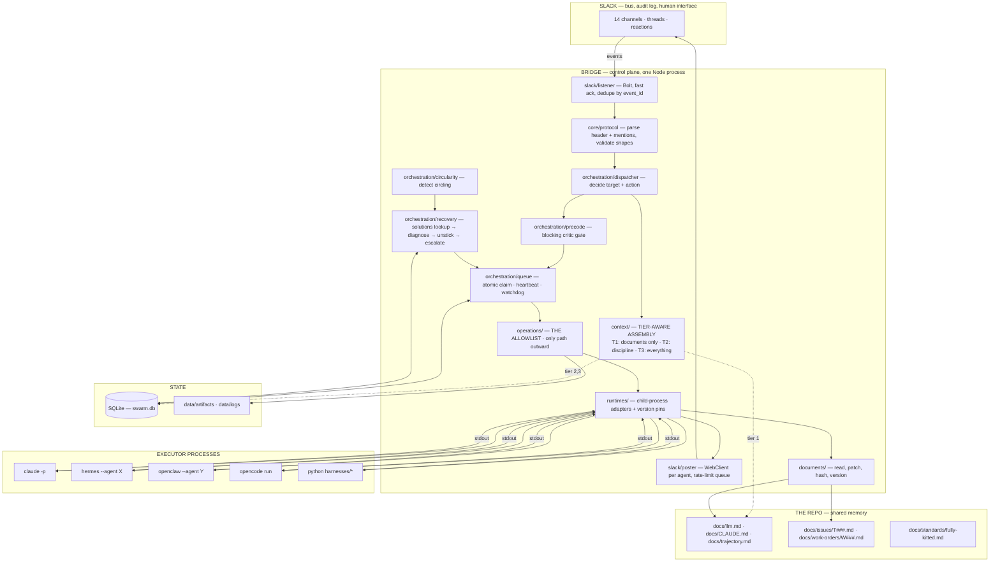
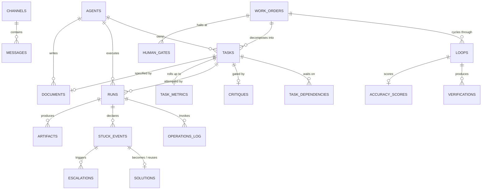

# Technical Architecture — VTO Autonomous Engineering Swarm

**Version 3.0** · Draft for review · 2026-08-08
**Companion to:** [[PRD]] v3.0 (what and why). This document is *how*.
**Rewritten from scratch** to build in all twelve findings of [[GAP-ANALYSIS]]. v2.0's context strategy was wrong at the root; this version treats context discipline as a first-class subsystem rather than a parameter.

---

## 0. Architectural position

Seven constraints drive every decision below. When a choice looks conservative, it is one of these.

| # | Constraint | Consequence |
|---|---|---|
| **C1** | New agents get added continuously | Agents are declarative definitions, not code branches. Routing is capability-based. Adding an agent = drop a folder. Zero core edits. |
| **C2** | Different tiers need opposite context | Context assembly is a **subsystem**, not a function argument. Tier 1 never touches message history. |
| **C3** | Documents are the medium; Slack is the pointer | The repo is the shared memory. The message table is an index, not the payload. |
| **C4** | Slack is the only inter-agent channel | The control plane is a Slack-event-driven state machine. No internal RPC between agents. |
| **C5** | One operator, one machine, Windows | Modular monolith. No Kubernetes, no Redis, no broker. Every service added is one the operator babysits. |
| **C6** | Executors must not improvise | A fixed **allowlist** of operations is the only path outward. Wrong calls are made inexpressible, not merely forbidden. |
| **C7** | Unattended operation spending real money | Durable state, idempotent handling, kill switch, cost cap, and named human accountability are load-bearing. |

**The single most important structural decision:** an orchestrator is not a running process. It is a `(context) → decision` function — a system prompt, a model, a toolset, a capability set. The control plane invokes it on demand. This is what makes C1 cheap: a new agent is data, not a deployment.

**The second most important:** context assembly is tier-aware and lives in its own package. Getting this wrong does not crash anything — it silently degrades the most expensive agent in the system into a log reader. Structural separation is the only reliable guard.

---

## 1. Tech stack

### 1.1 Summary

| Layer | Choice | Version |
|---|---|---|
| Control-plane language | **TypeScript** on Node.js | Node 22 LTS · TS 5.6+ |
| Package manager | **pnpm** workspaces | 9.x |
| Slack transport | **@slack/bolt** (Socket Mode) + **@slack/web-api** | 4.x / 7.x |
| Database | **SQLite** via `better-sqlite3` → Postgres later | 11.x |
| ORM + migrations | **Drizzle ORM** + drizzle-kit | 0.36+ |
| Config | **YAML** + **Zod** validation | — |
| Secrets | `dotenv` from a git-ignored `.secrets.env` | — |
| Process control | `child_process.execFile` + `tree-kill` | — |
| Document handling | `gray-matter` + `remark` | — |
| Logging | **Pino** (structured JSON) | 9.x |
| Testing | **Vitest** + event-replay fixtures | 2.x |
| Verification harnesses | **Python 3.11** + Playwright + numpy/scikit-image | — |
| Supervision | **PM2** as a Windows service | 5.x |

### 1.2 Reasoning

**TypeScript on Node.js — not Python, not Go.**
Three reasons in order of weight. The highest-risk surface is the **message and document protocol** — header parsing, state transitions, payload shapes, the operation union. Those are compile-time bugs, and they are precisely the bugs that stay invisible until an unattended loop mis-routes a task at 3am. Second, Slack's SDKs are TypeScript-first and Bolt's typings cover every event you will handle. Third, there is already a working, offline-verified Node bridge with passing tests; discarding it to restart in Python buys nothing.

Go was considered and rejected: concurrency primitives you do not need, weaker ecosystem for the two things you do need (Slack, child-process orchestration), slower iteration on logic that will churn weekly.

**Not LangGraph / CrewAI / AutoGen.**
This is the choice most teams get wrong. Those frameworks own the orchestration loop — they decide how agents hand off, retry, and terminate. Your control flow is the product: tier-differentiated context, document-mediated hand-off, a blocking pre-code critic, discipline-specific recovery with a five-level ladder, over Slack, with external CLI executors. You would spend more effort escaping the framework's opinions than writing the ~3,000 lines of orchestration you actually need. Frameworks earn their keep when your control flow is generic. Yours is not.

**pnpm workspaces.**
The repo has genuinely separate units, and workspaces enforce the boundaries at build time. `packages/core` cannot import `packages/slack`, and the compiler says so. That discipline is what keeps C1 and C2 true as the agent count grows — in particular, it is what stops someone "helpfully" wiring message history into the Tier 1 path. pnpm over npm for its strict layout, which surfaces undeclared dependencies rather than hiding them.

**SQLite now, Postgres later — with the trigger written down.**
Slack is the audit log and the repo is the memory; neither is an operational store. You cannot ask a repo "which tasks are claimed and whose lock expired."

SQLite wins at this scale for architectural reasons, not laziness: it is a file (no service to start, crash, or secure), `better-sqlite3` is **synchronous** — which removes a whole class of races from the claim-lock path — and `BEGIN IMMEDIATE` gives atomic task claiming without Redis or `SELECT … FOR UPDATE`.

**Migrate when any one becomes true:** a second machine runs executors; a second human needs concurrent write access; a remote dashboard needs live state; or `SQLITE_BUSY` exceeds the retry budget. Until then Postgres is ops burden without payoff.

Because that trigger is real, use **Drizzle**: schema in TypeScript, both dialects supported, migration becomes a config change plus review of the few SQLite-isms. Kysely is equally fine. Prisma is not — weaker SQLite support and a generated client that fits capability lookups poorly.

**Task queue in the database — no Redis, no BullMQ.**
A `tasks` table with an atomic claim *is* a work queue. Redis means a second daemon on a Windows box, a second thing to monitor, a second state that can disagree with the first. Scale here is single-digit concurrency. Revisit only when you outgrow one machine — at which point you are migrating to Postgres anyway and can use `SKIP LOCKED`.

**@slack/bolt to receive, raw @slack/web-api to send.**
Bolt handles the tedious, easy-to-get-subtly-wrong parts: the 3-second ack, Socket Mode reconnection, retry semantics, middleware. But Bolt assumes one app identity, and you need **one WebClient per agent bot token** so messages appear under the right name. One Bolt app (Admin, the listener) for events; a map of raw clients for posting.

**YAML config + Zod.**
Agent definitions and channel maps are configuration, which is the whole point of C1. YAML is readable and diffable; Zod validates at boot and **fails loudly** rather than letting a typo'd model slug surface as a 3am runtime error. Rule: config for structure, environment for secrets, never the reverse.

**gray-matter + remark for documents.**
Progressive documents and issue files are markdown with frontmatter. You need to read frontmatter reliably, rewrite sections without clobbering the rest, and hash content for change detection. These two libraries do exactly that and nothing more.

**Pino.**
Structured JSON from day one. You will grep these logs to answer "why did T037 escalate," and unstructured logs turn that into archaeology. Child loggers map cleanly onto per-task context.

**Vitest with event-replay fixtures.**
The valuable tests are not unit tests of a parser — they are: *given this recorded sequence of Slack events, does the state machine decide correctly?* Record real events to `fixtures/`, replay offline with no network. Vitest over Jest for native ESM and TS without a transform layer.

**Python stays for verification harnesses.**
Playwright's Python bindings already work for the video test, and accuracy needs numpy/scikit-image/LPIPS — an ecosystem Node cannot match. Invoked as subprocesses with a JSON contract on stdout. Clean boundary; do not port.

**PM2.**
The Bridge is the single point of failure. It must restart on crash and start on boot. PM2 installs as a Windows service and does both. `node bridge.js` in a terminal is not a posture for an unattended system.

---

## 2. System architecture

### 2.1 Component view



### 2.2 The request lifecycle

1. **Receive.** Bolt gets the event. **Ack within 3 seconds — always, before any work.**
2. **Dedupe.** Insert `event_id` into `processed_events`. A primary-key conflict means Slack retried; drop silently.
3. **Parse.** Extract `[W014/T037 · loop 3 · stage=CODE · attempt 2]` and `@VTO-*` mentions. Unparseable messages are logged and ignored, never guessed at.
4. **Index.** Write a `messages` row. This is an index for Tier 2/3 context and for audit — **not** the payload.
5. **Decide.** The dispatcher determines what this means for the state machine, applying the routing rules: STUCK → owning orchestrator; test failure → Admin; video/accuracy → Claude.
6. **Gate.** If the action is "dispatch a coding task," check for an `APPROVED` critique. Absent → route to Critic instead. **Non-bypassable.**
7. **Assemble context — by tier.** See §3. Tier 1 resolves to a document path that never reads `messages`.
8. **Claim.** Open a transaction, claim a slot, write a `runs` row with a lock expiry.
9. **Execute.** Operations are resolved from the allowlist; `execFile` with a timeout. Never `exec` — no shell means no injection surface.
10. **Persist output.** Documents written through `documents/` (hashed, versioned). Logs to disk. Post to Slack under the agent's own token; set the reaction state.
11. **Detect.** Run the circularity detector on the completed run, regardless of what the executor claimed.
12. **Record.** Update `runs`, log the operation, write `artifacts`, roll up `task_metrics` on terminal states.

### 2.3 Concurrency and the claim protocol

```sql
BEGIN IMMEDIATE;
  SELECT id FROM tasks
   WHERE status = 'ready'
     AND (required_capability <> 'code.implement' OR id IN
          (SELECT task_id FROM critiques WHERE verdict IN ('approved','approved_with_notes')))
     AND NOT EXISTS (SELECT 1 FROM task_dependencies d
                      JOIN tasks p ON p.id = d.depends_on_task_id
                     WHERE d.task_id = tasks.id AND p.status <> 'done')
   ORDER BY priority DESC, created_at ASC
   LIMIT 1;
  INSERT INTO runs (task_id, executor_agent_id, status, lock_expires_at) VALUES (…);
  UPDATE tasks SET status = 'claimed', attempt = attempt + 1 WHERE id = ?;
COMMIT;
```

`BEGIN IMMEDIATE` takes the write lock up front, so two dispatcher ticks cannot claim the same task. The critique sub-select is the **PRE-CODE gate enforced in SQL** — a coding task with no approved critique is not claimable, which is a far stronger guarantee than a check in application code that someone can forget.

Set `PRAGMA journal_mode = WAL; PRAGMA busy_timeout = 5000; PRAGMA foreign_keys = ON;` at every connection open.

**Watchdog.** A timer sweeps every 60s for `runs` where `status = 'running'` and `heartbeat_at < now − stale_window`. Those flip to `reclaimed`, the task returns to `ready`, `attempt` bumps — **no failure penalty**. A dead slot is infrastructure, not a bad task, and conflating them is how good tasks get abandoned.

---

## 3. Context discipline — the subsystem

This is the correction that motivated v3. It gets its own package so it cannot be bypassed by accident.

### 3.1 The policy

```ts
// packages/context/src/policy.ts
export type ContextPolicy = 'documents-only' | 'discipline' | 'full';

export function policyFor(agent: Agent): ContextPolicy {
  switch (agent.tier) {
    case 1: return 'documents-only';   // strategist — NEVER message history
    case 2: return 'discipline';       // orchestrator — its own channel + the relevant doc
    case 3: return 'full';             // executor — everything
  }
}
```

| Policy | Assembles | Reads `messages`? | Session |
|---|---|---|---|
| `documents-only` | `llm.md` + `trajectory.md` + repo/PR/issue snapshot + **one curated report** | **No — structurally impossible** | Fresh, every invocation |
| `discipline` | Task thread + own-channel history + the relevant progressive document | Filtered to own channel + task | Fresh per task |
| `full` | Complete cross-channel task history, prior attempts, errors, diffs | Yes, unfiltered | Fresh per run |

### 3.2 Why the structural separation

The `documents-only` assembler lives in a module that **does not import the `messages` repository at all**. That is deliberate. A tier check inside one shared function is a convention someone will eventually route around; a module that cannot reach the data is a guarantee the compiler enforces.

### 3.3 The curated report

Tier 1's only view of execution is a synthesis written by an orchestrator — never a transcript.

```ts
interface Report {
  workOrderId: string;
  attempted: string;      // ≤ 3 sentences
  learned: string;        // ≤ 5 bullets
  decisionNeeded: string; // one question, or "none — informational"
  evidence: string[];     // Slack permalinks + artifact paths, not inlined content
}
```

Hard-capped at 2,000 characters. Overflow is truncated with a pointer, not silently included. The cap is the mechanism: the product owner writes the report; the CTO does not read the developer's terminal.

### 3.4 The ENRICH stage

```
ENRICH(codebase):
  1. Claude reads current llm.md + trajectory.md
  2. Claude inspects the repo, merged PRs, closed issues since last enrich
  3. Claude rewrites both documents in place
  4. documents/ hashes, versions, and commits them
  5. Diff posts to #swarm-docs for human visibility
```

Triggers: work-order start · loop end · after any large refactor · manual `swarmctl enrich`.

A staleness check runs at every Tier 1 assembly: if the document's version predates the last three loops, the assembler **warns in-channel** and proceeds. Silent staleness would degrade every strategic decision with no signal.

---

## 4. The extension mechanism (C1)

### 4.1 An agent is a folder

```
agents/coder/
├─ agent.yaml       # identity, model, runtime, channel, capabilities
├─ system.md        # the system prompt
└─ handlers.ts      # OPTIONAL — custom diagnose/parse/preDispatch hooks
```

```yaml
# agents/coder/agent.yaml
id: coder
display_name: VTO Coder
tier: 2
kind: orchestrator
runtime: hermes
model: openrouter/deepseek/deepseek-v4-pro
token_env: SLACK_BOT_CODER
primary_channel: swarm-code
also_reads: [swarm-admin, swarm-critique]

capabilities: [code.implement, code.refactor, code.debug]

requires_precode_critique: true      # blocks dispatch until Critic approves

executor:
  agent: openclaw
  max_concurrent: 2
  timeout_seconds: 900
  allowed_operations: [repo.diff, repo.pr, test.types, lint]

recovery:
  max_attempts: 2
  escalates_to: admin
  consult_solutions: true

reports:
  on_success: admin
  on_verification: null
```

### 4.2 Capability-based routing

Admin never names an agent. It emits an issue document with a `required_capability`, and the registry resolves it:

```ts
export function resolveOwner(capability: string, reg: Registry): AgentId {
  const candidates = reg.byCapability.get(capability) ?? [];
  if (!candidates.length) throw new NoCapableAgentError(capability);
  return candidates.filter(a => a.enabled).sort((a, b) => load(a) - load(b))[0].id;
}
```

Adding a `SecurityAuditor` that declares `code.audit` requires editing **zero** existing files. Without this, every new agent is a `switch` edit in the busiest and most dangerous file in the system.

### 4.3 Adding an agent — the complete procedure

```bash
pnpm swarmctl agent:new security-auditor   # scaffolds from agents/_template/
# 1. edit agent.yaml — capabilities, model, executor, allowed operations
# 2. write system.md
# 3. create the Slack app (manual OAuth); add SLACK_BOT_SECURITY to .secrets.env
# 4. add the channel to config/channels.yaml
pnpm swarmctl bootstrap channels
pnpm swarmctl check                        # registry + tokens + channels + CLI versions
pm2 restart swarm-bridge
```

**No core code changes.** That is the acceptance test for C1 — if adding an agent ever requires editing `packages/orchestration`, the abstraction has leaked and must be fixed before the next agent.

### 4.4 Optional hooks

Most agents need no code. When one does:

```ts
export interface AgentHandlers {
  diagnose?(ctx: RecoveryContext): Promise<Diagnosis>;   // override default diagnosis
  parseResult?(stdout: string): Promise<AgentResult>;    // Accuracy parses JSON, not prose
  preDispatch?(task: Task): Promise<Task>;               // inject extra context
  critique?(plan: Plan): Promise<Critique>;              // domain-specific pre-code checks
}
```

Accuracy and TestRunner use `parseResult`. Critic uses `critique`. Everyone else uses defaults.

---

## 5. File and folder structure

```
swarm/
├─ package.json · pnpm-workspace.yaml · tsconfig.base.json
├─ drizzle.config.ts · ecosystem.config.cjs        # PM2
├─ .env.example · .secrets.env.example · .gitignore
├─ README.md
│
├─ config/
│  ├─ swarm.config.yaml          # targets, caps, timeouts, denylist, enrich cadence
│  ├─ channels.yaml              # 14 channel defs, topics, bot membership
│  └─ runtimes.yaml              # CLI command templates + expected versions
│
├─ agents/                       # ◀── EXTENSION POINT (§4)
│  ├─ _template/{agent.yaml,system.md,handlers.ts}
│  ├─ claude/                    # T1 strategist
│  ├─ admin/                     # T2 scheduler + Slack listener
│  ├─ critic/                    # T2 constructive pre-code review
│  ├─ scout/ · researcher/ · coder/ · scaffolder/
│  ├─ test-runner/ · video-tester/ · accuracy/
│  └─ openclaw/ · opencode/      # T3 executors
│
├─ packages/
│  ├─ core/                      # domain — ZERO I/O, pure, fully unit-tested
│  │  └─ src/{protocol,stages,capabilities,recovery,escalation,critique,types,errors}.ts
│  │
│  ├─ context/                   # ◀── TIER-AWARE ASSEMBLY (§3)
│  │  └─ src/
│  │     ├─ policy.ts            # tier → policy
│  │     ├─ documents-only.ts    # T1 — DOES NOT IMPORT the messages repo
│  │     ├─ discipline.ts        # T2
│  │     ├─ full.ts              # T3
│  │     └─ report.ts            # the 2,000-char Report contract
│  │
│  ├─ documents/                 # ◀── PROGRESSIVE DOCS + ISSUES
│  │  └─ src/
│  │     ├─ registry.ts          # read/write/hash/version, backed by the documents table
│  │     ├─ progressive.ts       # llm.md · CLAUDE.md · trajectory.md
│  │     ├─ issues.ts            # docs/issues/T###.md
│  │     ├─ enrich.ts            # the ENRICH stage
│  │     └─ staleness.ts         # version-vs-loop check
│  │
│  ├─ operations/                # ◀── THE ALLOWLIST (C6) — only path outward
│  │  └─ src/
│  │     ├─ index.ts             # execute(op: Operation)
│  │     ├─ types.ts             # the Operation union
│  │     └─ ops/{build,test,lint,video,accuracy,fetch,repo,deploy,shell}.ts
│  │
│  ├─ db/
│  │  └─ src/{schema.ts,client.ts,migrations/,repos/}
│  │
│  ├─ slack/
│  │  └─ src/{listener,poster,history,reactions,blocks}.ts
│  │
│  ├─ runtimes/
│  │  └─ src/
│  │     ├─ index.ts             # run(agent, {contextFile, instructionFile})
│  │     ├─ adapters/{claude,hermes,openclaw,opencode,python}.ts
│  │     ├─ versions.ts          # pin check; warn loudly on drift
│  │     ├─ denylist.ts          # git block — defence in depth
│  │     └─ sanitize.ts          # ANSI strip, secret redaction, truncation
│  │
│  ├─ registry/
│  │  └─ src/{loader,resolve,schema}.ts
│  │
│  ├─ orchestration/
│  │  └─ src/
│  │     ├─ dispatcher.ts        # event → decision → action
│  │     ├─ queue.ts             # atomic claim, heartbeat, watchdog
│  │     ├─ precode.ts           # the blocking critic gate
│  │     ├─ recovery.ts          # solutions lookup → diagnose → unstick → escalate
│  │     ├─ circularity.ts       # four detectors
│  │     ├─ solutions.ts         # store + reuse accounting
│  │     ├─ work-order.ts · decomposer.ts · gate.ts
│  │
│  └─ observability/
│     └─ src/{logger,metrics,cost,incidents}.ts
│
├─ apps/
│  ├─ bridge/src/main.ts         # ◀── the long-running control plane
│  ├─ cli/src/                   # swarmctl: check · dry-run · enrich · pause · agent:new
│  └─ bootstrap/src/             # Slack setup: whoami · create-channels · ids
│
├─ prompts/                      # composed into each agent's system.md
│  ├─ protocol.md                # message format every agent must emit
│  ├─ stuck-contract.md          # the four required STUCK fields
│  ├─ constructive-critic.md     # helpful-skeptic stance + pair-every-risk rule
│  ├─ report-contract.md         # the Report shape and its cap
│  └─ safety.md                  # never git; never print secrets; operations only
│
├─ harnesses/                    # Python — do not port
│  ├─ video_test/{run_video_test.py,convert.py,videos/}
│  ├─ accuracy/{accuracy.py,refs/}
│  └─ requirements.txt
│
├─ fixtures/events/*.json        # recorded Slack events for replay tests
│
├─ test/
│  ├─ unit/                      # core/ — pure functions
│  ├─ replay/                    # fixture-driven state-machine tests
│  └─ integration/               # against a temp SQLite file
│
├─ data/                         # GITIGNORED
│  ├─ swarm.db
│  ├─ artifacts/{diffs,frames,reports}/
│  └─ logs/
│
└─ doc/                          # PRD · TECHNICAL-ARCHITECTURE · GAP-ANALYSIS
```

**Documents live in the target repo, not here.** `llm.md`, `CLAUDE.md`, `trajectory.md`, `docs/issues/`, `docs/work-orders/`, and `docs/standards/fully-kitted.md` are written into `VTO_REPO_PATH`, because they describe that codebase and must version alongside it.

**The dependency rule, enforced by the build:** `core` imports nothing. `db`, `slack`, `runtimes`, `registry`, `documents`, `operations`, `context` import only `core` (plus `db` where they persist). `orchestration` imports all. `apps` import `orchestration`. **`context/documents-only.ts` may not import `db/repos/messages`** — a lint rule enforces this specifically, because it is the one violation that would fail silently.

---

## 6. Database schema

SQLite via Drizzle, written dialect-neutral. **Twenty tables.**

### 6.1 Entity relationships



### 6.2 Tables in plain English

---

**`agents` — the roster.**
One row per agent, mirrored from `agents/*/agent.yaml` at boot so other tables can foreign-key to it. The YAML is the source of truth; this is a queryable snapshot.

| Field | Type | Meaning |
|---|---|---|
| `id` | text PK | Stable slug: `coder`, `critic`, `openclaw` |
| `display_name` | text | Slack display name |
| `tier` | int | 1 strategist · 2 orchestrator · 3 executor. **Drives the context policy.** |
| `kind` | text | `strategist` \| `orchestrator` \| `executor` |
| `runtime` | text | Which CLI runs it |
| `model` | text | Model slug passed to the runtime |
| `token_env` | text | Env var **name** holding its bot token — never the token itself |
| `slack_user_id` | text | `U0…`, filled by `bootstrap whoami` |
| `primary_channel_id` | text FK | Where it posts by default |
| `capabilities` | json | `["code.implement","code.refactor"]` — the routing keys |
| `allowed_operations` | json | Which operations it may invoke. Empty = none. |
| `requires_precode_critique` | bool | If true, its tasks cannot be claimed without an approved critique |
| `max_concurrent` | int | Executor slots it may hold |
| `enabled` | bool | Soft-disable without deleting history |
| `created_at` · `updated_at` | timestamp | |

> An agent **owns** many tasks (as orchestrator) and **executes** many runs (as executor). One table holds both because an executor is just an agent with `tier = 3`.

---

**`channels` — the Slack map.**
Populated by `bootstrap ids`. Other tables reference it so a rename does not orphan history.

| Field | Type | Meaning |
|---|---|---|
| `id` | text PK | Slack `C0…` |
| `name` · `purpose` | text | `swarm-code` · the topic string |
| `is_private` | bool | True only for `swarm-human-gate` |
| `created_at` | timestamp | |

---

**`documents` — progressive documents and issue files.**
The registry over the repo's markdown. Content lives in git; this table indexes it so the system knows what exists, what version, and whether an agent has read the current one.

| Field | Type | Meaning |
|---|---|---|
| `path` | text PK | Repo-relative: `docs/trajectory.md`, `docs/issues/T037.md` |
| `kind` | text | `definitions` \| `agent_rules` \| `trajectory` \| `issue` \| `work_order` \| `standard` |
| `codebase` | text | Which repo — plural from day one |
| `version` | int | Bumped on every write |
| `sha256` | text | Detects out-of-band edits by a human |
| `last_written_by` | text FK | Agent that wrote it |
| `last_written_at` | timestamp | |
| `last_enriched_loop` | int, null | For progressive documents: which loop last refreshed it. **Drives the staleness check.** |
| `work_order_id` · `task_id` | FK, null | Set for issue and work-order documents |
| `created_at` | timestamp | |

> A document **may belong to** a work order or task; progressive documents belong to neither. ENRICH writes `kind in ('definitions','trajectory')`; Admin writes `kind = 'issue'`; Claude writes `kind = 'work_order'`.
>
> *Design note:* bodies are **not** stored here. Storing them would create a second source of truth that silently diverges from git.

---

**`work_orders` — what Claude decided is worth doing.**
One per gap identified. Carries intent and acceptance criteria, never a task breakdown.

| Field | Type | Meaning |
|---|---|---|
| `id` | text PK | `W014` |
| `title` · `intent` · `evidence` · `constraints` | text | The narrative |
| `acceptance_criteria` | json | Array of checkable statements — the definition of satisfied |
| `document_path` | text FK | The `docs/work-orders/W014.md` file |
| `status` | text | `draft` \| `active` \| `blocked` \| `satisfied` \| `withdrawn` |
| `current_loop` | int | Which improvement cycle it is on |
| `created_by_agent_id` | text FK | `claude` today; the FK keeps it honest as agents are added |
| `origin_channel_id` · `origin_ts` | text | Slack anchor for the whole tree |
| `created_at` · `updated_at` · `closed_at` | timestamp | |

> A work order **has many** loops and tasks, and **halts at** one or more human gates. It ends `satisfied` (target met, human committed) or `withdrawn`.

---

**`loops` — one full improvement cycle.**
Groups everything produced in one pass. Without it, "accuracy over time" and "cost per loop" are unanswerable.

| Field | Type | Meaning |
|---|---|---|
| `id` | int PK | |
| `work_order_id` | text FK | |
| `index` | int | 1, 2, 3… within this work order |
| `enriched` | bool | Whether ENRICH ran this loop |
| `started_at` · `ended_at` | timestamp | |
| `exit_reason` | text | `advanced` \| `redo_below_target` \| `escalated` \| `abandoned` |

---

**`tasks` — the units of work.**
Every executor invocation traces to exactly one row.

| Field | Type | Meaning |
|---|---|---|
| `id` | text PK | `T037` |
| `work_order_id` · `loop_id` | FK | Parents |
| `title` | text | |
| `document_path` | text FK | **The issue file is the spec.** This table holds state; the document holds content. |
| `required_capability` | text | **The routing key.** Admin sets it; the registry resolves it to an owner. |
| `owner_agent_id` | text FK, null | Resolved orchestrator |
| `stage` | text | `RESEARCH` \| `PRE_CODE` \| `CODE` \| `SCAFFOLD` \| `TEST` \| `VIDEO` \| `ACCURACY` \| `REVIEW` |
| `status` | text | `todo` → `ready` → `claimed` → `running` → (`stuck`) → `review` → `done` \| `failed` \| `blocked` \| `cancelled` |
| `attempt` · `max_attempts` | int | Used; cap (default 2) |
| `parent_task_id` | text FK, null | Set when this reworks another — the lineage chain |
| `priority` | int | Higher first |
| `channel_id` · `thread_ts` | text | Where its diary lives |
| `created_by_agent_id` | text FK | Always `admin` |
| timestamps | | `created_at`, `started_at`, `completed_at` |

> A task **belongs to** a work order and loop; is **owned by** one orchestrator; **is specified by** one document; **waits on** zero or more tasks; **is gated by** at most one critique; **is attempted by** one or more runs; may have a **parent** it reworks.
>
> *Two "done"s:* `review` means the executor finished; `done` means the orchestrator accepted. Collapsing them is how unverified work slips through.

---

**`task_dependencies` — the wait-for graph.**

| Field | Type | Meaning |
|---|---|---|
| `task_id` | text FK | The waiter |
| `depends_on_task_id` | text FK | The blocker |
| PK | | `(task_id, depends_on_task_id)` |

> Many-to-many over `tasks`. Must stay acyclic — the decomposer rejects cycles at creation, because a cycle deadlocks the queue silently.

---

**`critiques` — the PRE-CODE gate record.**
One row per pre-code review. **Its existence is what makes a coding task claimable** (§2.3).

| Field | Type | Meaning |
|---|---|---|
| `id` | int PK | |
| `task_id` | text FK UNIQUE | One live critique per task |
| `critic_agent_id` | text FK | Normally `critic` |
| `verdict` | text | `approved` \| `approved_with_notes` \| `revise` |
| `will_it_work` | text | Assessment against `llm.md` |
| `regression_surface` | text | What breaks, and what to do about it |
| `fully_kitted_pass` | bool | Error states + logging checked against the standard |
| `known_solution_id` | int FK, null | Set when the solutions store already had this |
| `risks` | json | `[{risk, alternative}]` — **`alternative` is NOT NULL inside each entry** |
| `notes` | text | |
| `channel_id` · `slack_ts` | text | |
| `created_at` | timestamp | |

> A critique **gates** exactly one task. The `risks` shape enforces the rule that makes critique constructive rather than paralysing: **a risk without an alternative cannot be stored**, so a critic cannot return pure negation. That is the difference between a helpful skeptic and an obstacle, encoded in the schema.

---

**`runs` — one execution attempt.**

| Field | Type | Meaning |
|---|---|---|
| `id` | uuid PK | |
| `task_id` | text FK · `attempt` int | |
| `executor_agent_id` | text FK | `openclaw` or `opencode` |
| `status` | text | `claimed` \| `running` \| `succeeded` \| `failed` \| `stuck` \| `timed_out` \| `reclaimed` \| `cancelled` |
| `context_policy` | text | Which policy assembled its context — needed to debug bad decisions |
| `command_redacted` | text | The spawn command with secrets masked |
| `claimed_at` · `heartbeat_at` · `lock_expires_at` | timestamp | The watchdog reads only `heartbeat_at` |
| `started_at` · `finished_at` · `exit_code` | | |
| `stdout_path` · `stderr_path` | text | Paths under `data/logs/` — **never blobs in the DB** |
| `tokens_in` · `tokens_out` | int | `−1` when unknown, never `0` |
| `cost_usd` | real | Computed at write time from the model's rate |
| `summary` | text | One line for humans |

> A run **belongs to** one task and one executor; **invokes** operations; **may declare** stuck events; **produces** artifacts.
>
> *Design note:* a single verbose run can emit megabytes. Logs on disk; the state machine's queries stay fast.

---

**`operations_log` — every transaction through the middleware.**
The audit surface for C6. If it did not go through here, it did not happen.

| Field | Type | Meaning |
|---|---|---|
| `id` | int PK | |
| `run_id` | uuid FK, null | Null for system-initiated operations |
| `agent_id` | text FK | Who asked |
| `op` | text | `build.widget`, `test.unit`, … |
| `params_redacted` | json | Arguments with secrets masked |
| `allowed` | bool | **False rows are the interesting ones** — an agent tried something outside its allowlist |
| `exit_code` | int, null | |
| `duration_ms` | int | |
| `created_at` | timestamp | |

> An operation **belongs to** a run and an agent. Rows with `allowed = false` are a direct signal that an agent's prompt or allowlist is misconfigured — alert on them.

---

**`stuck_events` — recovery, made measurable.**
One row per stuck declaration, self-reported *or system-detected*.

| Field | Type | Meaning |
|---|---|---|
| `id` | int PK | |
| `run_id` · `task_id` | FK | |
| `declared_by_agent_id` | text FK | The executor — or **`system`** for detector-fired events |
| `detection_source` | text | `self_declared` \| `repeat_signature` \| `file_churn` \| `verification_oscillation` \| `no_progress` |
| `what_attempted` | text **NOT NULL** | Required contract field |
| `error_text` | text **NOT NULL** | Verbatim, never paraphrased |
| `resources_touched` | json **NOT NULL** | Files, URLs, commands |
| `hypothesis` | text **NOT NULL** | The executor's own guess |
| `state_complete` | bool | False → rejected and re-requested, **not** escalated |
| `theme_hash` | text | Normalized `(error_class, resources)`. Caps count per theme. |
| `solution_id` | int FK, null | Set when the store answered without a model call |
| `diagnosed_by_agent_id` | text FK, null | The orchestrator that responded |
| `diagnosis` · `unstick_directive` | text | |
| `resolution` | text | `resolved_from_store` \| `resolved_l1` \| `resolved_l2` \| `resolved_l3` \| `escalated_human` \| `abandoned` |
| `resolution_level` | int | 0–4. The metric that matters. |
| `resolved_at` · `created_at` | timestamp | |

> A stuck event **belongs to** one run; **may reuse or become** a solution; **may trigger** escalations.
>
> *The four NOT NULLs are deliberate.* An orchestrator cannot diagnose a shrug, so the database refuses to store one. Policy enforced in DDL survives 3am; policy enforced in a prompt does not.

---

**`solutions` — the knowledge store.**
A resolved stuck event *is* a solution record. This table makes it retrievable so nothing is diagnosed twice from first principles.

| Field | Type | Meaning |
|---|---|---|
| `id` | int PK | |
| `theme_hash` | text | Lookup key, unique per codebase |
| `codebase` | text | Solutions are codebase-specific; a fix for one repo may be wrong for another |
| `problem_signature` | text | Human-readable failure class |
| `diagnosis` · `directive` | text | Why it happens · what to do |
| `source_stuck_event_id` | int FK | Origin |
| `times_reused` | int | Incremented per hit |
| `success_rate` | real | Reuses that resolved ÷ total. **Below 0.5, stop serving and re-diagnose.** |
| `created_at` · `last_used_at` | timestamp | |

> One-to-one with its originating stuck event; consulted by the recovery engine **and by the Critic** (§ PRE-CODE) before any model call.
>
> *Retrieval:* exact `theme_hash` match first. Add vector similarity only if exact matching proves too narrow — starting with a vector database is the expensive way to learn you needed a hash lookup.

---

**`escalations` — every hand-off up the ladder.**

| Field | Type | Meaning |
|---|---|---|
| `id` | int PK · `task_id` text FK | |
| `stuck_event_id` | int FK, null | Null for non-stuck escalations (e.g. repeated test failure) |
| `from_level` · `to_level` | int | 1→2, 2→3, 3→4 |
| `from_agent_id` · `to_agent_id` | text FK | |
| `reason` | text **NOT NULL** | Why this level could not resolve it |
| `created_at` | timestamp | |

> `reason` is NOT NULL by design: an escalation without a diagnosis is a bug, and the schema makes it unrepresentable. Query `AVG(to_level)` for the escalation-depth guardrail.

---

**`verifications` — every check that ran.**

| Field | Type | Meaning |
|---|---|---|
| `id` | int PK | |
| `work_order_id` · `loop_id` | FK · `task_id` FK, null | Null for loop-level checks |
| `kind` | text | `test` \| `video` \| `accuracy` \| `review` |
| `verifier_agent_id` | text FK | |
| `passed` | bool, null | Null when informational rather than pass/fail |
| `summary` | text | The Slack one-liner |
| `payload` | json | Kind-specific: test counts, per-clip verdicts, findings |
| `artifacts` | json | Paths to logs and frames |
| `channel_id` · `slack_ts` · `created_at` | | |

> Routing follows the PRD rule: `kind = 'test'` with `passed = false` → Admin; `kind in ('video','accuracy')` → Claude.

---

**`accuracy_scores` — the north-star number.**
Separate from `verifications` because it is queried constantly for the trend and its term breakdown must be first-class, not buried in JSON.

| Field | Type | Meaning |
|---|---|---|
| `id` | int PK · `loop_id` · `work_order_id` FK | |
| `score` | real | The composite, 0–1 |
| `target` | real | Default 0.98, **stored per row** so a threshold change does not rewrite history |
| `passed` | bool | `score >= target` |
| `term_verdict` · `term_fit` · `term_perceptual` · `term_stability` | real, null | 30 / 25 / 35 / 10 % weights |
| `active_terms` | json | Which terms were computable this run |
| `weights` | json | Weights actually applied after renormalising over active terms |
| `notes` | text | Honest caveats, posted verbatim to Slack |
| `created_at` | timestamp | |

> *Design note:* nullable term columns plus `active_terms` encode the honesty requirement structurally. Until FittingBox references exist, perceptual and fit are NULL and the composite renormalises. A score without its active-terms list is not reportable.

---

**`messages` — the Slack index.**
Every parsed message, mirrored locally. Used for Tier 2/3 context and for audit. **Never read for Tier 1.**

| Field | Type | Meaning |
|---|---|---|
| `channel_id` · `slack_ts` | text | Composite PK |
| `thread_ts` | text, null | Null for thread roots |
| `agent_id` | text FK, null | **Null means a human posted** — how operator interventions are found |
| `work_order_id` · `task_id` | FK, null | Parsed from the header |
| `loop_index` · `stage` · `attempt` | | Parsed header fields |
| `kind` | text | `dispatch` \| `pointer` \| `result` \| `stuck` \| `unstick` \| `critique` \| `escalation` \| `verification` \| `gate` \| `human` \| `incident` |
| `text` | text | Full body |
| `created_at` | timestamp | |

> Index on `(task_id, created_at)` — the hottest query in the system for Tier 2/3 assembly.

---

**`processed_events` — idempotency.**

| Field | Type | Meaning |
|---|---|---|
| `event_id` | text PK · `event_type` text | Slack's id |
| `received_at` | timestamp · `outcome` text | `handled` \| `ignored` \| `error` |

> Insert first, act second. A PK conflict means "already seen" — drop silently. Prune beyond 7 days.

---

**`human_gates` — where the loop stops.**

| Field | Type | Meaning |
|---|---|---|
| `id` | int PK · `work_order_id` text FK | |
| `channel_id` · `slack_ts` | text | The card |
| `diff_summary` | text · `evidence` json | Test, video, accuracy references |
| `status` | text | `awaiting` \| `approved` \| `rejected` \| `expired` |
| `resolved_by` | text, null | Slack user id of the human |
| `resolved_at` · `created_at` | timestamp | |

> `approved` records only that a human said yes. **The system never records a commit, because it never performs one.**

---

**`artifacts` — files produced.**

| Field | Type | Meaning |
|---|---|---|
| `id` | int PK · `task_id` / `run_id` FK, null | |
| `kind` | text | `diff` \| `pr` \| `log` \| `frame` \| `finding` \| `report` \| `json` |
| `path` | text | Relative to `data/` |
| `bytes` · `sha256` | | Detects silent overwrite |
| `created_at` | timestamp | |

---

**`task_metrics` — the rollup.**
One row per terminal task, written once. Denormalised on purpose: the weekly review must not run eight joins.

| Field | Type | Meaning |
|---|---|---|
| `task_id` | text PK FK | |
| `duration_s` · `attempts` | int | |
| `stuck_count` | int · `stuck_from_store` int | How many recoveries needed no model call |
| `max_escalation_level` | int | 0 = never escalated |
| `critique_verdict` | text, null | Whether the critic changed the plan |
| `tokens_total` · `cost_usd` | | Summed across all runs |
| `human_touches` | int | Human messages in this task's threads |
| `outcome` | text | `done` \| `failed` \| `cancelled` |
| `created_at` | timestamp | |

> One-to-one with `tasks`. Written by a **single writer** (the dispatcher, on terminal transition) to avoid the concurrent-write problem the swarm's own research already documented.

### 6.3 Indexes that matter

```sql
CREATE INDEX        idx_tasks_ready       ON tasks(status, priority DESC, created_at);
CREATE INDEX        idx_runs_watchdog     ON runs(status, heartbeat_at);
CREATE INDEX        idx_messages_task     ON messages(task_id, created_at);
CREATE INDEX        idx_stuck_resolution  ON stuck_events(resolution_level, created_at);
CREATE INDEX        idx_stuck_theme       ON stuck_events(theme_hash, task_id);      -- circularity
CREATE UNIQUE INDEX idx_solutions_theme   ON solutions(theme_hash, codebase);        -- lookup-before-model
CREATE UNIQUE INDEX idx_critiques_task    ON critiques(task_id);                     -- one gate per task
CREATE INDEX        idx_documents_kind    ON documents(codebase, kind);              -- tier-1 assembly
CREATE INDEX        idx_ops_denied        ON operations_log(allowed, created_at);    -- allowlist violations
CREATE INDEX        idx_accuracy_trend    ON accuracy_scores(work_order_id, created_at);
```

### 6.4 Retention

`messages`, `stuck_events`, `solutions`, and `critiques` are permanent — they are the learning corpus. `processed_events` prunes at 7 days. `operations_log` prunes at 90 days except `allowed = false` rows, which are permanent. `runs` rows are permanent; their stdout files rotate out of `data/logs/` at 30 days, leaving a dead path and a live summary — acceptable and intentional.

---

## 7. Environment variables

### 7.1 `.secrets.env` — git-ignored, never committed, never logged

```bash
# ── Slack: 12 bot tokens + 1 app token ───────────────────────────────
SLACK_APP_TOKEN=xapp-...          # connections:write. ONLY on the listener app (Admin).
SLACK_BOT_ADMIN=xoxb-...          # listener + workspace admin (channels:manage, groups:write)
SLACK_BOT_CLAUDE=xoxb-...
SLACK_BOT_CRITIC=xoxb-...
SLACK_BOT_SCOUT=xoxb-...
SLACK_BOT_RESEARCH=xoxb-...
SLACK_BOT_CODER=xoxb-...
SLACK_BOT_SCAFFOLD=xoxb-...
SLACK_BOT_TEST=xoxb-...
SLACK_BOT_VIDEO=xoxb-...
SLACK_BOT_ACCURACY=xoxb-...
SLACK_BOT_OPENCLAW=xoxb-...
SLACK_BOT_OPENCODE=xoxb-...

# ── Model providers ──────────────────────────────────────────────────
ANTHROPIC_API_KEY=sk-ant-...      # or rely on the Claude CLI's own auth
OPENROUTER_API_KEY=sk-or-...      # Hermes + OpenClaw

# ── Product ──────────────────────────────────────────────────────────
VTO_STORE_PASSWORD=...            # dev-store password for the video harness
```

### 7.2 `.env` — non-secret, committed as `.env.example`

```bash
NODE_ENV=production
LOG_LEVEL=info

# ── Storage ──────────────────────────────────────────────────────────
DATABASE_URL=file:./data/swarm.db
ARTIFACTS_DIR=./data/artifacts
LOGS_DIR=./data/logs

# ── Repos + documents ────────────────────────────────────────────────
VTO_REPO_PATH=C:/Users/<you>/shopify/nmg-vto
SWARM_ROOT=C:/Users/<you>/swarm
DOCS_SUBPATH=docs                 # progressive docs live at <repo>/<DOCS_SUBPATH>/
ENRICH_EVERY_N_LOOPS=1            # 1 = every loop
DOC_STALENESS_WARN_LOOPS=3        # warn in-channel past this

# ── Executor CLI paths (absolute; see §8 note 2) ─────────────────────
CLAUDE_BIN=C:/Users/<you>/.local/bin/claude.exe
HERMES_BIN=C:/Users/<you>/AppData/Local/hermes/bin/hermes.exe
OPENCLAW_BIN=C:/Users/<you>/AppData/Local/openclaw/bin/openclaw.exe
OPENCODE_BIN=C:/Users/<you>/AppData/Local/hermes/node/node_modules/opencode-ai/bin/opencode.exe
PYTHON_BIN=C:/Python311/python.exe

# ── Executor version pins — swarmctl check WARNS LOUDLY on drift ─────
EXPECTED_OPENCODE_VERSION=1.18.14
EXPECTED_OPENCLAW_VERSION=2026.7.1-2
EXPECTED_HERMES_VERSION=0.18.0
EXPECTED_CLAUDE_VERSION=2.1.216

# ── Concurrency + timeouts ───────────────────────────────────────────
MAX_CONCURRENT_RUNS=3
RUN_TIMEOUT_SECONDS=900
HEARTBEAT_INTERVAL_SECONDS=60
STALE_LOCK_SECONDS=1800
WATCHDOG_INTERVAL_SECONDS=60

# ── Loop control ─────────────────────────────────────────────────────
TARGET_ACCURACY=0.98
MAX_ATTEMPTS_PER_THEME=2
MAX_LOOPS_PER_WORK_ORDER=10       # hard stop; prevents infinite spend
DAILY_COST_CAP_USD=50             # exceeding pauses the swarm and alerts

# ── Context discipline ───────────────────────────────────────────────
REPORT_MAX_CHARS=2000             # the Tier-1 report cap
TIER1_ALLOW_MESSAGE_HISTORY=false # MUST stay false. Present only so a violation is auditable.

# ── Recovery ─────────────────────────────────────────────────────────
SOLUTIONS_MIN_SUCCESS_RATE=0.5    # below this, stop serving a stored solution
CIRCULARITY_REPEAT_THRESHOLD=3
CIRCULARITY_CHURN_THRESHOLD=3

# ── Safety ───────────────────────────────────────────────────────────
GIT_DENYLIST=git commit,git push,git merge,git rebase,git reset --hard
ALLOW_RAW_SHELL=false             # shell.raw operation; never enable for tier 3
DRY_RUN=false                     # decide and log; never spawn or post
SWARM_PAUSED=false                # kill switch; also togglable from Slack
```

### 7.3 Config files (not environment)

**`config/swarm.config.yaml`** — loop targets, caps, denylist, enrich cadence, channel purposes. Zod-validated at boot; the process **refuses to start** on invalid config rather than degrading.

**`config/channels.yaml`** — 14 channel definitions with topic and bot membership, consumed by `bootstrap create-channels`.

**`config/runtimes.yaml`** — command templates with `{model} {context_file} {instruction_file}` placeholders. **Templates, not hard-coded flags** — see §8 note 3.

---

## 8. Configuration notes before you start

Each of these has already cost time in the existing system.

**1. OpenCode's gateway is free-tier only on this account.** A paid-model call returns `"No payment method"`. This is *why* the multi-CLI design exists rather than routing everything through one gateway. Do not "simplify" it away — that refactor was tried and killed.

**2. `claude` on PATH may be a shim, not the real binary.** In the existing setup it resolves to Hermes. Always spawn via the absolute `CLAUDE_BIN`. A run that silently targets the wrong binary produces plausible output from the wrong model — the worst failure mode there is.

**3. Never invent CLI flags.** Confirm each runtime's invocation with `--help` and record it in `config/runtimes.yaml`. Known-good today: `opencode run "<msg>" -m <model>`. Guessed flags fail at 3am with an unhelpful exit code.

**4. Pin the executor CLIs; verify at startup.** Upgrading a working agent CLI reliably introduces technical debt because the implementation behaves differently. `swarmctl check` compares each binary against `EXPECTED_*_VERSION` and warns loudly. Treat any upgrade as a change requiring a full replay-test pass.

**5. Strip ANSI from all CLI stdout before posting or parsing.** Escape codes render as garbage in Slack and break header parsing. Apply it in the adapter, not the call site, so a new adapter cannot forget.

**6. A bot only receives events for channels it is in.** The listener (Admin) must be invited to *every* channel; workers join only their own. `bootstrap create-channels` handles it; verify with `swarmctl check`.

**7. Slack rate-limits `chat.postMessage` to roughly 1/sec/channel.** Documents-as-payload cuts volume substantially — post a pointer, not a wall of text. The poster owns a per-channel queue; never call `WebClient` directly.

**8. Use `execFile`, never `exec`.** `exec` runs through a shell, so an agent-authored string could inject commands. `execFile` takes an argv array. Agents write these strings; this is not paranoia.

**9. Prefer the allowlist to the denylist.** The git denylist is defence in depth; the actual control is `packages/operations`. A denylist permits everything an agent can invent. An allowlist makes the wrong call **inexpressible**. Implementation inconsistency — an agent blowing context and reaching for the wrong call — is the most common production breakage in this architecture, and only the allowlist addresses it.

**10. SQLite needs three pragmas.** `journal_mode = WAL`, `busy_timeout = 5000`, and `foreign_keys = ON` at every connection open. Foreign keys are **off by default** in SQLite — without that pragma every FK in §6 is decorative.

**11. Windows paths and PowerShell.** Prefer forward slashes (Node accepts them on Windows) or `path.join`. Do not assume a POSIX shell exists.

**12. Ack Slack within 3 seconds, always.** Ack first, enqueue second. Working before acking causes retries, which cause duplicate execution. The dedupe table is a backstop, not a substitute.

**13. Never log a token, even at trace level.** `swarmctl check` prints a masked map (`xoxb-…4f2a`). Route every log through the redaction serializer.

**14. Store every timestamp in UTC.** Cron-style windows read local time on Windows; that mismatch fires watchdog sweeps at the wrong hour.

**15. Seed the progressive documents before the first run.** An empty `trajectory.md` means Tier 1 starts blind and the whole context discipline is theatre. Run one ENRICH pass and **read it yourself** before trusting it.

---

## 9. Build sequence

Ordered by dependency and by risk-retired per unit of effort.

| # | Milestone | Deliverable | Done when |
|---|---|---|---|
| 1 | **Core** | `packages/core` — protocol, stages, capabilities, recovery contract, critique contract, theme hashing | 100% unit coverage; pure, no I/O |
| 2 | **Schema** | `packages/db` — all 20 tables, migrations, repos | Migrate up/down clean; FKs enforced; NOT NULLs verified |
| 3 | **Documents** | `packages/documents` + seeded `llm.md`, `CLAUDE.md`, `trajectory.md` + the ENRICH prompt | A human reads `trajectory.md` and understands the project |
| 4 | **Context** | `packages/context` — three assemblers + the lint rule forbidding the Tier-1 import | A test proves `documents-only` cannot reach `messages` |
| 5 | **Registry** | `packages/registry` — loader, Zod schema, capability index | `agent:new` scaffolds a working agent |
| 6 | **Operations** | `packages/operations` — the union and its implementations | An op outside the union is a **type error**; denied attempts are logged |
| 7 | **Runtimes** | adapters, version pins, sanitizer, denylist | Version drift warns; ANSI stripped; adversarial git fixture blocked |
| 8 | **Slack offline** | `packages/slack` + `swarmctl dry-run` | Replays a fixture, prints decisions, zero network |
| 9 | **Orchestration** | dispatcher, queue, precode gate, recovery, circularity, solutions | Replay tests cover happy, critique-revise, stuck, circling, escalation, watchdog |
| 10 | **Bridge live** | `apps/bridge` on Socket Mode | One real task, one real recovery, one real critique |
| 11 | **Phase 1 agents** | Claude, Admin, Critic, Coder, TestRunner, OpenClaw | PRD Phase 1 exit criteria met |
| 12 | **Verification** | VideoTester, Accuracy + Python harnesses | Score published every loop |
| 13 | **Research arm** | Scout, Researcher, Scaffolder | Research visibly changes an implementation |

**Steps 1–9 need no Slack tokens.** The entire state machine, the context discipline, the critique gate, and the recovery engine are testable offline against recorded fixtures. Manual Slack app creation blocks only step 10 onward.

---

## 10. Open technical decisions

1. **Where do research findings live?** The vault (`Findings/*.md`) and the repo both claim to be memory. Recommendation: findings become documents in the target repo under `docs/findings/`, indexed in the `documents` table, and summarised into `trajectory.md` by ENRICH. Decide before Phase 3 or they diverge.
2. **Should ENRICH be incremental or a full rewrite?** Full rewrite is coherent and expensive; incremental is cheap and drifts. Start with full rewrite of `trajectory.md` and incremental append to `llm.md`; revisit with cost data.
3. **Should the Critic see prior critiques for the same work order?** Consistency argues yes, independence argues no. Currently yes, bounded to the same work order.
4. **Does Admin need memory across work orders?** Stateless today. Recurring decomposition patterns might justify a templates table — decide from data.
5. **Multi-repo support.** `VTO_REPO_PATH` is singular but `documents.codebase` and `solutions.codebase` are already plural. Finish the seam deliberately rather than by accident.
6. **Cost attribution when a runtime reports no tokens.** Currently `−1`. Consider a per-runtime estimator so `cost_usd` is never silently wrong.

---

## Related

[[PRD]] · [[GAP-ANALYSIS]] · [[SLACK-ORCHESTRATION]] · [[AGENT-HIERARCHY]] · [[ENGINEERING-LOOP]] · [[F011 orchestration-metrics]] · [[F011 orchestration-failure-modes]] · [[F011 orchestration-context-hygiene]]
